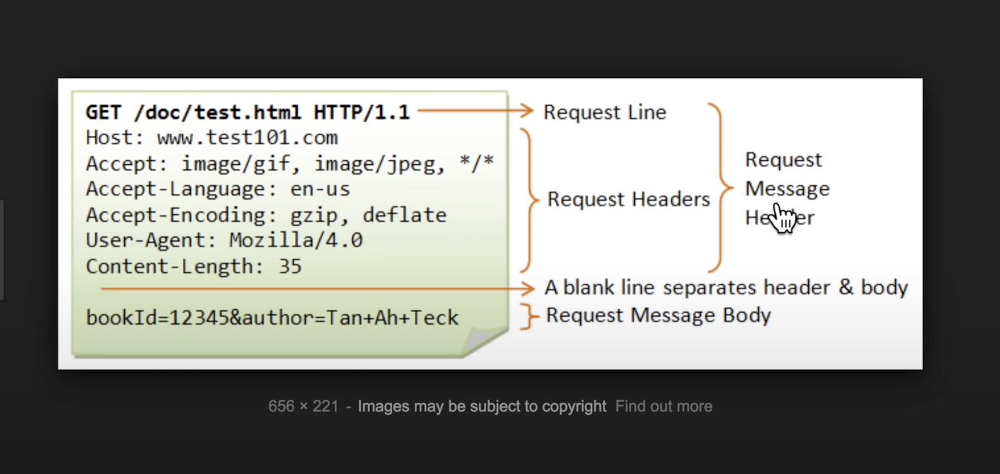
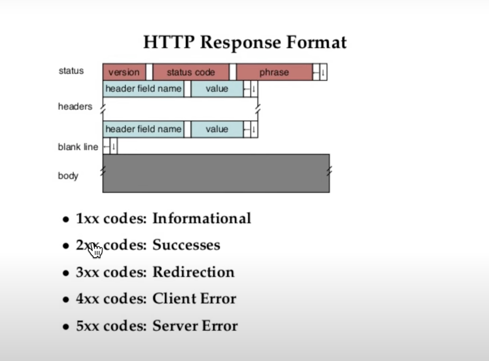

# HTTP 소개

## HTTP (HyperText Transfer Protocol)

- 요청(request)

  - 서버에게 HTML 주라고 요청

- 응답(resposne)

  - "여기 있습니다"라고 하고 HTML을 주는 행위

- HTTP는 request와 response를 나타냄

- HTML, CSS, JavaScript 이미지와 같은 파일들은 서로가 주고받는 컨텐츠라면, 그 컨텐츠를 주고받기 위해서는 서버와 클라이언트가 서로 알아들을 수 있는 공통의 약속인 메시지가 필요한데 그 메세지를 HTTP라고 하고,

- HTTP는 request와 response를 위한 메시지로 구분되어 있음

## 크롬 개발자 도구

### Network 탭

- 웹 브라우저와 웹 서버가 어떤 통신을 하고 있는지 모니터링할 수 있는 도구

- html 파일을 요청한 경우를 가정해보자,

  - html을 클릭하면 웹 브라우저와 웹 서버가 서로 주고받은 데이터, HTTP 메시지를 볼 수 있음

- html 코드에 img 태그가 있고, JPG 이미지가 있으면 웹 브라우저는 그것을 보고 그 이미지 파일을 다시 웹 서버한테 우리 모르게 조용히 요청하게 되고 이를 확인할 수 있다.

- Headers라는 부분에 **Request Headers**가 웹 브라우저가 웹 서버에게 요청한 데이터

- **Request Headers** 옆의view source를 클릭하면 날 것 그대로를 보여줌

- 즉, 이러한 텍스트로 만들어서 웹 브라우저가 웹 서버에게 보내준 것

  ```tsx
  // request header의 view source

  GET /1.html HTTP/1.1 // `GET` 방식으로 `1.html`을 요청하면서 지금 사용할 수 있는 통신 방법은 `HTTP/1.1`이다는 정보
  Host: localhost: 8080 // 웹 브라우저가 어떤 웹 서버의 주소로 접속했는지에 대한 정보
  // 위 이 두 줄이 필수적인 정보

  ```

- 아래는 response header

  ```tsx
  // response header의 view soruce

  HTTP/1.1 200 OK
  // `HTTP/1.1 200 OK` : 첫 번째 줄에는 반드시 이렇게 생긴 코드를 넣도록 약속되어 있음 (이게 필수)
  // "나도 `HTTP/1.1`로 통신할 거야"라고 본인의 통신 방법을 웹 서버가 웹 브라우저에게 응답하는 컨텐츠
  // `200`이라는 것은 "성공적으로 데이터를 찾아서 너에게 보내줄게"라는 뜻

  Content-Length: 1434 // 이 컨텐츠의 길이가 얼마나 되는가를 보여줌
  Content-Type: text/html
  // 웹 서버가 웹 브라우저에게 응답하는 이 정보가 `text`이고 `text` 중에 `html`이다는 것을 알려줌
  // 그러면 웹 브라우저는 이러한 정보들을 받아서 본인의 필요에 따라서 잘 처리해서 화면에 표시해주게 됨

  ```

- 웹 브라우저

  - (Request) Headers라는 텍스트 정보를 만들어서 사용자가 요청한 정보를 웹 서버에게 대신 물어봐주는 기계

- 웹 서버

  - 본인이 갖고 있는 정보를 보내주면서 Response Headers라는 응답 헤더를 만들어주는 기계

  - 그러면 웹 브라우저는 그렇게 응답한 정보를 화면에 적당히 그려주는 역할을 하는 프로그램

<br/>

# Request message

- 웹 브라우저에서 웹 서버로 접속할 때 `Request Headers`를 보면



- 제일 먼저 나오는 행(요청 행(Request Line)) : `GET /1.html HTTP/1.1`

- Request Message Header

- 서버 쪽으로 전송해야 될 정보가 있다면 그 정보가 실제 내용임 ("페이로드")

  - Request Message Body

- Body와 Header는 그 중간에 blank line을 둬서 구분

### GET /1.html HTTP/1.1

- `GET` : 메소드

  - 웹 브라우저와 웹 서버가 어떤 방식으로 통신할 것인가

  - `GET`은 데이터를 웹 서버로 가져올 때 씀

  - e.g. 주소 치고 엔터 치는 것

- `POST`

  - e.g. 로그인 전송 버튼 누르면 데이터 전송

- `/1.html` : 웹 서버에게 요청하는 정보

  - 웹 서버는 `/1.html`을 보고서 그것에 따라 웹 브라우저가 요청한 정보를 응답해주게 됨

- `HTTP/1.1` : 웹 브라우저가 현재 사용하고 있는/사용할 수 있는 HTTP의 버전이 1.1

  - 웹 서버는 이 정보를 바탕으로 해서 웹 브라우저에게 적당한 방식으로 통신을 함

- `Host: localhost:8080`이라는 이 부분부터는 Request Header

- `Host: localhost:8080`

  - 여러 가지 Request Headers가 있지만 그 중에서 반드시 적어야 하는 필수적인 것

  - Host : 인터넷에 연결되어 있는 컴퓨터 한 대 한 대를 식별하는 이름 (Host name)

  - Host라고 적는 것은 우리가 요청하는 이 웹사이트 웹 서버의 주소를 적는 것

  - Host가 있으면 하나의 웹 서버가 여러 개의 도메인을 서비스 할 수 있음

  - 그런 경우에는 예를 들면 a라는 웹 서버가 a.com, b.com, c.com이라는 도메인을 호스팅하고 있고 각각의 주소별로 다른 웹사이트라고 한다면 웹 서버는 `Host: localhost:8080`에 적혀 있는 주소가 무엇이냐에 따라서 다른 정보를 보내줄 수 있음

    - 이를 가상 "가상 호스트" 라고 한다

  - `8080` : 포트

    - 한 대의 컴퓨터에는 여러 대의 서버가 설치되어 있을 수 있음

    - `8080`이라고 하면 `8080`이라는 포트 번호에 등록되어 있는 웹 서버를 이야기하는 것

### User-Agent

- 웹 브라우저의 다른 표현

- 웹 브라우저를 User Agent라고도 함

- 즉 요청하는 웹 브라우저가 어떤 웹 브라우저인지를 보여줌

- `Chrome`

- `(Macintosh; Intel Mac OS X 10_13_5)` : 우리가 사용하고 있는 운영 체제가 Macintosh, Intel CPU를 쓰고 있고 Mac OS 버전이 어떻다고 하는 것

- 나중에 웹 서버를 잘 운영해보면 통계 같은 걸 내게 되는데 이 웹사이트에는 어떤 브라우저와 운영 체제를 쓰는 사람들이 많이 접속하고 있는가 이러한 정보들을 `User-Agent`를 통해서 볼 수 있음

- 경우에 따라서는 `User-Agent`가 Chrome이나 Firefox나 이런 것이 아니라 어떤 로봇이 접근할 수 있음 (검색 엔진 로봇 등)

- 그런 경우에는 웹 서버는 이 정보를 바탕으로 해서 그 요청을 차단할 수 있음 (본인이 원하지 않은 요청일 수도 있음)

- `User-Agent`는 그런 목적으로 사용됨

### Accept-Encoding

- 웹 브라우저와 웹 서버가 서로 통신할 때 응답하는 데이터의 양이 많으면 그걸 압축해서 전송하면 웹 브라우저가 그것을 압축을 풀어서 처리할 수 있음

- 그러면 네트워크의 자원을 아낄 수 있음

- 그때에 이 웹 브라우저는 어떤 압축 방식을 지원한다고 적어놓은 것

- 그러면 웹 브라우저는 여기에 있는 이 세 가지 방식 중의 하나, 본인이 선호하는 걸 보내줄 수 있음

- 웹 브라우저는 이 중의 하나를 처리할 수 있기 때문

### If-Modified-Since: Tue, 17 Jul 2018 23:28:26 GET

- 지금 우리가 `1.html`이라는 파일을 웹 서버에게 요청했는데 그리고 다시 요청을 또 할 수도 있음

- 그러면 요청할 때마다 그걸 다운로드 받는 게 효율적이지 않음

- 그런 경우에 `If-Modified-Since`라고 되어 있는 부분이 이 정보를 우리가 서버에게 전송한다는 것은 내가 갖고 있는 이 파일은 마지막으로 언제 다운로드 받은 파일이다는 것을 서버에게 알려 줌

- 그러면 웹 서버는 응답할 때 본인이 갖고 있는 파일이랑 무엇이 더 최신인지를 비교해서 본인이 갖고 있는 파일이 최신이면 전송해주고 최신이 아니면(더 다운로드할 필요가 없으면) 전송하지 않아도 되는 것

- 속도도 줄일 수 있고 서로에게 윈윈이 되는 것

<br/>

# Response message



- 첫 번째 행에는 status(상태)가 나옴

- 즉, 서버가 응답했을 때 이게 잘 됐는지 잘 안 됐는지 잘 안 됐으면 어떻게 안 됐는지를 알려주는 자세한 정보

  - version (HTTP version)

  - status code : 응답 결과에 대한 것

  - phrase : 응답 결과를 사람이 이해하기 쉽도록 말로 풀어쓴 것

### HTTP/1.1 200 OK

- `HTTP/1.1`이라는 포맷을 쓰고 있음

### status code

- 1xx informational response : 어떤 정보를 주기 위한 것들은 100번대(잘 안 씀)

- 2xx success : 200번대는 성공했다는 뜻

  - 여기 status code에 들어오는 이 정보가 2xx라고 한다면 아주 긍정적인 메시지

  - 가장 중요한 것 : 200 OK (성공했다는 뜻)

  - 그 다음에 나오는 것들은 성공은 성공인데 디테일하게 사족을 다는 것들

- 3xx Redirection

  - Redirection : a.com으로 접속하면 서버가 30x를 응답해주게 되면 웹 브라우저가 다른 곳으로 바로 다시 이동

  - 나중에 서버 쪽 애플리케이션들(예 : PHP, NodeJS, Python, Django)을 배우게 되면 그때 자연스럽게 이렇게 나오게 되어 있음

- 4xx Client errors : 클라이언트 쪽 에러

  - 그 중에 유명한 것 : 404 Not Found

    - 어떤 주소로 접속했는데 서버에 그게 없으면 서버가 왜 없는 거를 요청하냐, 찾을 수 없다고 나오는 것

  - 403 Forbidden도 많이 나옴

    - 접속하면 안 되는 곳에 접속했을 경우 서버가 오면 안 된다, 오는 곳 아니다(관계자 외 출입금지)라고 하는 것

- 5xx Server errors : 서버 쪽에 문제가 있을 경우

  - 유명 : 500 Internal Server Error

  - 서버 내부적으로 어떤 문제가 있어서 지금은 서비스 할 수 없다는 정보를 보여줄 때 이것을 보내주는 것

### headers

- `Content-Type: text/html` : 굉장히 중요한 헤더

  - 웹 서버가 응답할 때 이 응답은 `text`고 `html`이라는 컴퓨터 언어이다, 라고 하면 웹 브라우저는 저걸 보고서 그 정보를 HTML로 해석해서 화면에 표시해 줌

  - `coding.jpg`라는 이미지를 클릭하면 `Response Headers`의 `Content-Type: image/jpeg`로 되어 있는 것을 볼 수 있음

- `Content-Length: 1434`

  - 응답하는 이 컨텐츠의 전체 크기는 `1434`라는 사이즈를 보여주는 것

  - 단위는 byte (1434 bytes)

- `Content-Encoding: gzip`

  - 이 컨텐츠는 `gzip`이라는 방식으로 압축해서 이것을 읽으려면 `gzip`으로 본문 압축을 풀어서 읽어야 한다는 내용

- `Last-Modified: Tue, 17 Jul 2018 23:28:26 GMT`

  - 이 정보는 마지막으로 언제 수정되었다는 것을 알려주는 내용

<br/>

- 웹 브라우저와 웹 서버가 서로 소통하는 것을 우리가 직접 텍스트로 만들어 보면 웹 브라우저는 요청을 하기 전에 Request Headers를 생성

- 그 다음에 또 웹 브라우저가 웹 서버에게 보내야 할 정보가 있을 수 있음

  - 첫 번째 줄이 `GET`이 아니라 `POST`인 경우

  - Request Headers에 웹 서버로 전송할 정보를 담음

  - 메시지를 만든 다음에 인터넷을 통해서 웹 서버에게 보내주면 웹 서버는 Request Headers에 있는 정보를 해석해서 응답 메시지를 만들어 주게 되는 것

- 응답 메시지 : Response Headers

  - Response Headers에서 HTML 코드 내용 전체를 인터넷을 통해서 요청한 컴퓨터로 보내주면 웹 브라우저는 Response Headers의 내용과 본문을 참조해서 사용자 화면에 표시해주는 것을 통해서 이 작업이 끝나게 되는 것

<br/>

# HTTP와 HTTPS의 차이점

- 주소창에 `http://`라고 시작하면 그것은 HTTP, `https://`로 시작하면 HTTPS 또는 SSL을 이용하고 있는 것

- HTTPS의 S는 "secure"의 약자로 "안전한"이라는 뜻

- HTTP가 세상에 처음 나왔을 때 세상은 그렇게 위험하지 않았음

  - 사람들은 웹을 통해서 심각한 정보를 다루지 않았음

  - 그로부터 30년이 지난 지금 우리는 웹을 통해서 군사, 금융, 사생활과 같은 정보를 다룸

  - HTTP를 통해서 통신을 하고 있다면 누군가 여러분의 정보를 보고 있는 것로 간주해야 함

- 하지만 HTTPS를 사용하면 전송하고 있는 내용을 가로챈다고 하더라도 실제로 그 안에 무슨 내용이 담겨 있는지는 당사자들만 알 수 있음

  - 암호화되어 있기 때문

- 여러분이 웹에 대한 소비자라면 HTTPS가 아닌 사이트에서 만약에 로그인을 요구한다면 그 사이트를 이용하지 말아야 함

- 여러분이 서비스를 만드는 생산자라면 운영하고 있는 사이트가 중요한 정보를 사용자와 주고받고 있다면 HTTPS를 꼭 도입해야 함

### Cache

- 저장한다는 뜻

- 한 번 웹사이트에 접속해서 어떠한 내용을 다운로드 받았다면 그 다음에 접속할 때 또 다운로드 받을 필요 없이 이미 다운로드 받은 저장된 파일을 읽어서 성능을 향상시키는 기법

- cache-control

  - 이러한 헤더 값들은 바로 캐시를 제어하는 테크닉

- 비교적 최신 기술인 애플리케이션 캐시와 같은 것들도 이러한 목적으로 고안된 기술

- 성능 향상에 관심이 간다면 캐시를 살펴보기

### Cookie

- 개인화

- 쇼핑몰 사이트에서 장바구니 이용

- 로그인을 하면 그 다음에 접속할 때에는 로그인 상태가 유지

  - 웹사이트를 방문할 때 이전에 처리했던 장바구니 담기, 로그인과 같은 기록들을 웹사이트와 웹 브라우저가 기억하고 있기 때문

- 이것을 가능하게 해주는 기술 : 쿠키

- 쿠키를 이용해서 쿠키 값을 웹 브라우저에 설정하면 접속할 때마다 그 설정됐던 쿠키 값을 서버에 전송하는 것을 통해서 사용자의 상태를 유지할 수 있고 사용자를 식별할 수 있음

- 최근에는 쿠키보다도 훨씬 더 많은 정보를 저장하면서도 보안적으로 더 우수한 web storage라는 기술이 등장

### Proxy

- 웹 브라우저와 웹 서버 사이에 프록시라고 불리는 이름의 중개 서버를 둘 수 있음

- 중간에 있는 서버가 캐시를 대신해 주거나, 보안과 관련된 공격을 막아 주거나, 적당히 사용자 요청을 여러 대의 서비스로 분산해주는 것과 같은 역할을 프록시 서버들이 대신해줄 수 있음

- 그 외에도 엄청나게 많은 일을 할 수 있음

- 여러분의 서비스가 복잡해지고 중요해지고 있다면 프록시 서버라고 불리는 기술을 알아보기

---

## Reference

- [생활코딩 - HTTP](https://opentutorials.org/course/4848)
