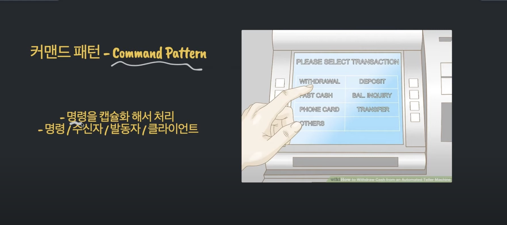
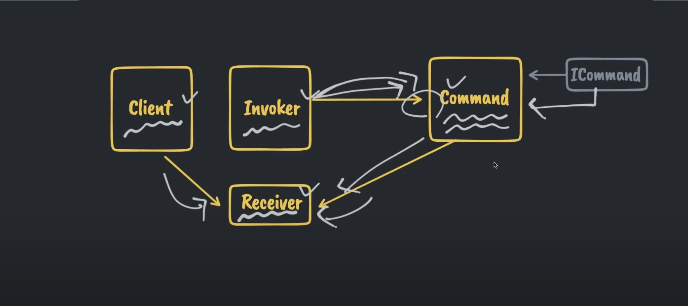
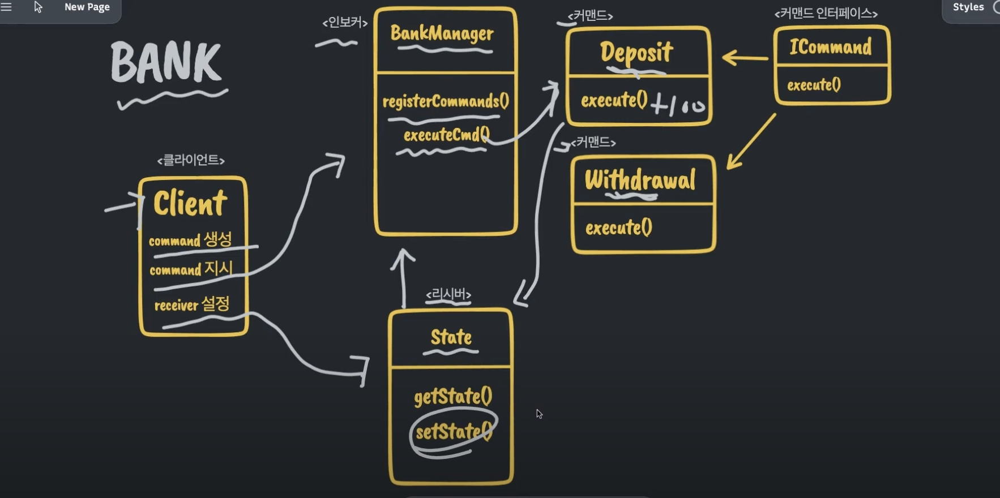

## Command Pattern

- Command Pattern은 여러 명령들을 추상화 해서 클래스로 정의하고 객체로 만들어서 사용하는 패턴이다.

- 여기서 명령들이란 간단한 명령이 될 수도 있고 다른 오브젝트를 발생시키는 명령에 될 수도 있다.

- 이렇게 명령들을 추상화 시키면 좋은 점은 명령들을 오브젝트 처럼 관리할 수 있고 이러한 오브젝트들을 모아 두었다가 정해진 시간에 실행시키는 등의 동작을 가능하게 해준다.

- Command Pattern은 행동적 디자인 패턴 카테고리에 속한다



- Command 즉, 명령을 캡슐화해서 처리하는 개념으로 이 패턴을 구성하는 요소는 다음과 같다

- 명령(Command) / 명령을 수신하는 수신자(Receiver) / 명령을 발동하는 발동자(Invoker) / 명령을 실행하는 클라이언트 (Client)

- 그리고 기본적으로 Command Pattern을 구성하는 요소들은 다음과 같다



- Client

  - 명령들을 생성하고 수신 담당의 Receiver를 설정해준다

- Receiver

  - 수신을 담당하고 명령이 전해졌을 때 그 기능을 수행하고 반영하는 역할을 한다

- Invoker

  - 발동자 역할을 하는 Invoker에 명령들이 저장이 되어있고

  - 실행 업무를 전달받을 시 직접 명령 객체를 호출한다

  - 그리고 실행을 하는 역할을 도와준다

- Command

  - 명령객체에 해당하는 Command는 미리 정의되어 있는 Interface를 구현한다

  - Invoker에게 지시 받은 명령을 전달하는 역할을 한다

  - 전달을 어떤 방법을 할지, 비즈니스 로직도 커맨드 객체에 포함을 하고 있다

- 아래와 같은 은행을 예시로 한 다이어그램을 통해 위의 요소들의 역할과 흐름에 대해 파악할 수 있다



- 우선 은행 창구 역할을 하는 Client에서 기본적으로 업무를 접수하고 실행하게 된다

- 그리고 Invoker 역할을 하는 BankManager는 은행 시스템이라고 볼 수 있다

- 그리고 Receiver 역할을 하는 State 클래스는 계좌, 통장과 같은 개념

- Command 역할을 하는 클래스들은 은행 업무와 관련된 입금, 출금, 이체와 같은 것들이다.

- 그리고 큰 흐름을 보면, Client가 일단 Deposit, Withdrawal과 같은 Command 클래스들의 인스턴스를 생성해준다

- 그 다음에 BankManager 인스턴스를 통해서 필요한 Command 클래스들을 registerCommands()라는 함수를 통해 등록을 시켜준다

- 그리고 Client의 receiver 설정을 통해서 receiver에 해당하는 State 클래스를 인스턴스화 한 후에 BankManager 생성시 전달을 해준다

- 그래서 해당 시점에서 계좌가 여기 BankManager 클래스에 등록이 되는 것

- 이렇게 준비 단계가 끝나면 Client 로직에 따른 지시 (command)를 BankManager에 전달할 수가 있다

- 그리기고 BankManager에서는 exectureCmd와 같은 함수를 사용해서 명령 객체의 이름 또는 추가적인 매개 변수를 활용을 해서 지시를 내린다

- 예를 들어서 BankManager에게 100원을 예금 해라는 뭐 지시를 전달한다고 했을 때 그 지시를 전달받는 BankManager는 해당 지시를 바탕으로 명령을 발동하게 된다

- 그래서 예금을 지시하는 거니까 이제 그에 상응하는 클래스를 찾아서 명령을 전달한다

- 그러면 예금 명령 클래스 Deposit 까지 지시가 전달이 되고

- 이 명령 클래스는 지시 요구 사항에 따라서 이제 금액을 더하면 된다

- 그리고 Receiver인 State 클라스의 명령을 내린다.

- 즉, State 클래스의 setState 함수를 호출해서 결과 값이 100원을 반환 해준다

- 그럼 이제 그게 이제 Receiver 역할을 하는 계좌에 그대로 반영이 되는 것이다

- 이와 같은 흐름이 Command Pattern의 기본 개념

- 그래서 각각의 명령들은 명령 인터페이스, ICommand 인터페이스만 준수를 한다면 얼마든지 또 추가 할 수가 있다.

- 예를들어 이체 Command, 대출 Command 등

- 그리고 이제 명령 객체 내부에서 세부적인 기능과 뭐 요구 사항들, 예를들면 비즈니스 로직 같은 것은 이제 독립적으로 관리를 할 수가 있다는 장점이 있다

- 그래서 Invoker와 Receiver와 상관없이 별개로 수정, 추가가 가능하다는 것

- 그래서 이런 명령 객체들이 Command Pattern의 키워드이다.

- 예를 들어 이 은행 창구에 업무가 이제 새로 파생되었다고 가정했을 때 그냥 간단히 그에 상응하는 명령 객체만 추가를 하면 된다

- 그리고 Invoker 클래스에 등록만 시켜주면 끝난다

- 따라서 확장이 용이하고 이제 클라스가 서로 의존 관계를 최소화할 수 있다는 장점이 있다

## 코드 구현

```ts
// Interface
abstract class ICommand{
  abstract execute(args):void;
}

// Receiver - 은행으로 따지면 은행계좌 역할
class State {
  private _state:number;
  constructor(state){
    this._state = state;
  }

  // getter 역할
  getState(){
    return this._state;
  }

  // setter 역할
  setState(value){
    this._state = value;
  }
}

// Invoker - 은행으로 따지면 BankManager 역할
class BankManager{
  private _state; // Receiver를 전달받아서 저장해야 하기 때문에 해당 변수에 저장
  private _command = {}; // command를 등록할 수 있는 객체

  constructor(state){
    this._state = state
  }

  // 클라이언트가 커맨드를 생성하고 등록할 때 호출하는 함수
  registerCommands(...args){
    for(const cmd of args){
      this._commands[cmd.constructor.name] = cmd
    }

  // 이름을 전달받고, 이름에 상응하는 Command 클래스를 찾아서 실행
  executeCmd(cmdName, param){
      this._commands[cmdName].execute(this._state, param)
    }
  }
}

// Command

// 예금
class Deposit implements ICommand{

  // 추상 메소드 구현
  execute(...params):void{
    const [state, amount] = params
    const prevState = state.getState(); // 기존에 있던 값 저장
    state.setState(prevState + amount); // 예금
    // 예를들어 100원 추가했을 때 기존 값에서 100원 추가해서 저장
  }
}

// 출금
class Withdrawl implements ICommand{

  // 추상 메소드 구현
  execute(...params):void{
    const [state, amount] = params;
    const prevState = state.getState();
    state.setState(prevState - amount);
  }
}

```

- 이렇게 작성된 코드를 아래처럼 사용할 수 있다

```ts
// 1. Command 생성
const deposit = new Deposit();
const withdrawl = new WithDrawl();

// 2. Receiver 생성
const state = new State(0); // 은행 - 계좌 역할, 잔고는 0원으로 시작

// 3. invoker 인스턴스 & receiver 등록
const bankManager = new BankManager(state);

// 4. commmand 등록
bankManager.resisterCommands(deposit, withdrawl);

// 5. command 지시
bankManager.executedCmd("Deposit", 100);
bankManager.executedCmd("Deposit", 1000);

console.log(state.getState()); // 잔고 확인 - 1100

bankManager.executedCmd("Withdrawl", 1000);

console.log(state.getState()); // 잔고 확인 - 100
```

- 이렇게 Command Pattern은 새로운 명령을 쉽게 추가할 수 가 있고 Invoker, Receiver등이 서로 의존성을 최소화 할 수 있다는 것이 장점이다

- 단점이라면 명령에 대한 각각의 클래스는 나중에 시스템이 엄청 커지거나 또는 요구되는 로직 들이 더 많아질 때 그 수가 엄청 늘어나서 코드가 복잡해 질 수 있다는 점이다.

---

## Reference

- [디자인패턴, Command Pattern, 커맨드 패턴, 명령 패턴](https://www.youtube.com/watch?v=bUULgkwaicQ)
- [개발자가 알아야할 디자인패턴 | ep5. Command Pattern | 자바스크립트 커맨드 패턴](https://www.youtube.com/watch?v=r601hDellMs&list=PL3xNAKVIm80JldJ6IZBx5eQxck5JA6VuV&index=5)
