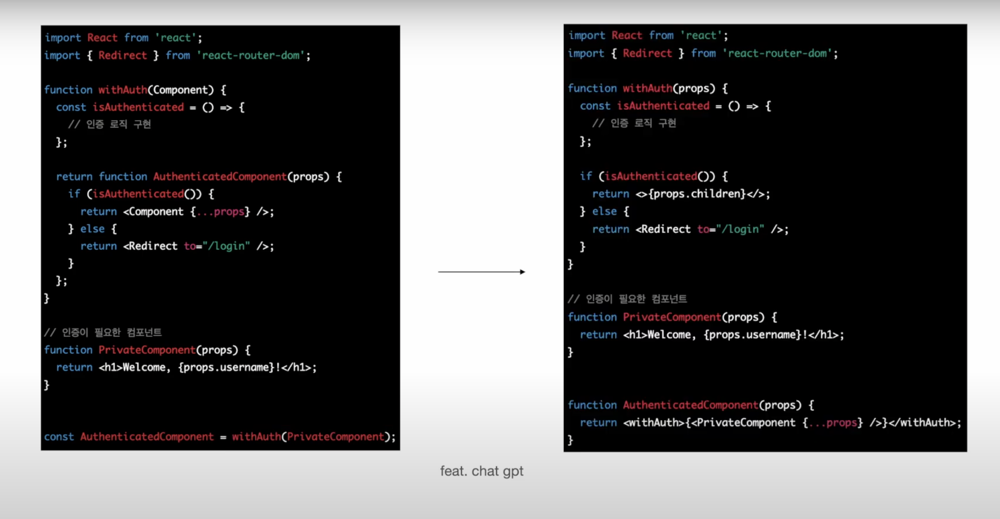
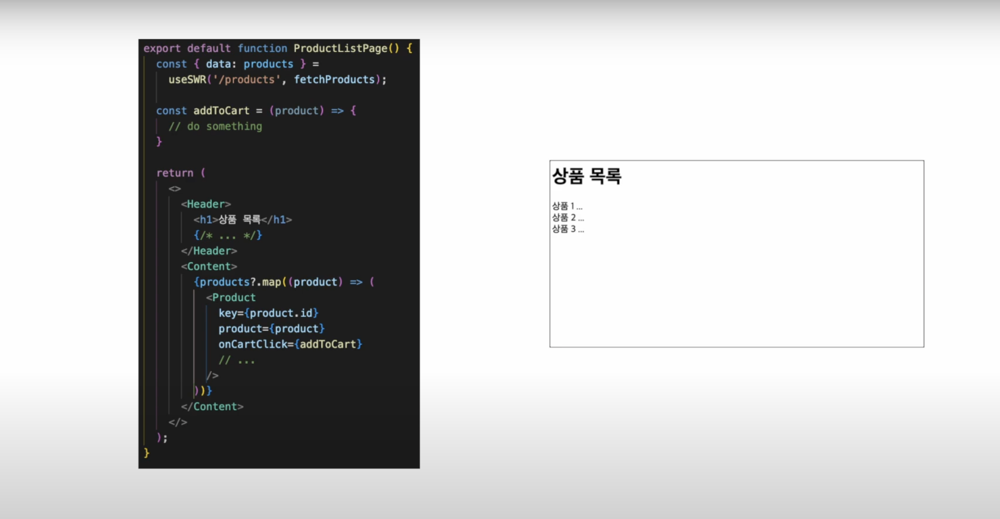
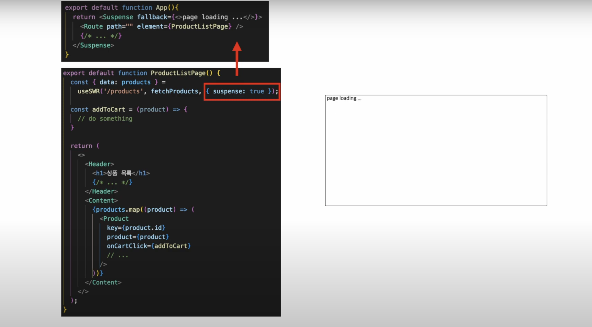
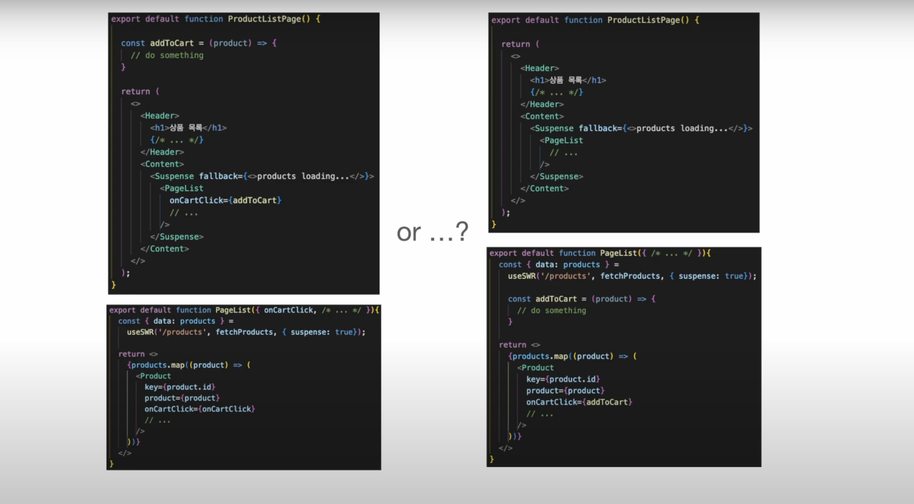
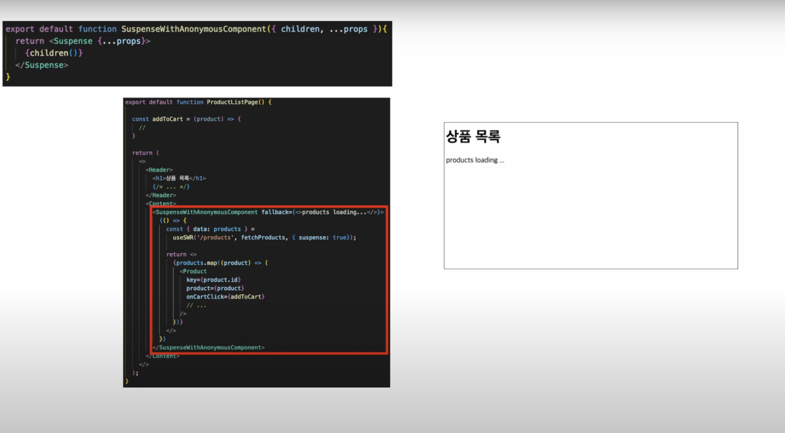
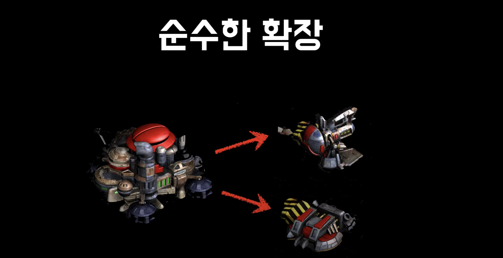
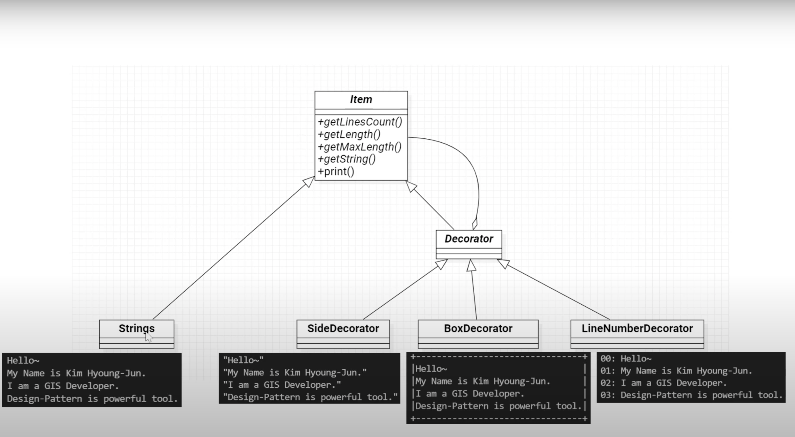

## Decorator Pattern

- Decoator 뜻은 "장식하는 사람"으로 장식되는 대상과 장식을 동일한 개념으로 처리한다

- 객체에 기능을 마치 장식처럼 계속 추가할 수 있는 패턴으로

- 기능을 실행 중에 동적으로 변경 또는 확장할 수 있는 패턴으로 프로그램의 확장성과 유연성을 향상 시킬 수 있다

- 정리하자면 Decorator 패턴은 어떤 객체에 기능(장식)을 적용할 때 그 객체와 적용될 기능을 동일시 할 수 있다

- 데이터와 기능을 동일시 할 수 있으므로 다양한 기능을 중첩해서 적용할 수 있으며 적용되는 기능의 순서에 따라 다른 결과를 얻을 수 있다

- 즉, 데코레이터 패턴은 기존의 동작을 유지하면서 기능을 추가하거나 확장할 때 유용하게 사용할 수 있다

- 주로 감싸는 형태, 즉 wrapper의 형태를 갖고 있다.

- 이런 방식으로 익숙하게는 고차함수(higher-order function)를 예로 들 수 있는데,

- 위키 백과에 따르면 고차함수는 '하나 이상의 함수를 인자로 받거나, 함수를 결과로 반환하는 것' 이라고 정의하고 있다

- 프론트엔드 개발자 입장에서 흔히 볼 수 있는 예시로는 debounce 함수가 있다

- debounce 함수는 특정 시간동안 중복된 실행이 있을 때 마지막 호출만 실행될 수 있도록 하는 역할을 한다

- 예를 들어서 아래와 같은 형태로 구현된 코드는 input 창에 키워드가 변경될 때마다 검색이 수행되면서 매번 요청이 발생하는것을 볼 수 있는데

```js
const search = (keyword) => getList(keyword);
//...
<Input onChange={serach} />;
```

- 여기서 아래와 같이 debounce 함수로 기존의 search 함수를 감싸주면

```js
const search = (keyword) => getList(keyword);
const debounceSearch = debounce(search, 500)
//...
<Input onChange={debounceSearch} />;
```

- 요청이 절약되도록 처리할 수 있고 이 형태를 search 함수가 debounce로 데코레이팅 되었다 라고 할 수 있다.

- 고차함수인 debounce는 다음과 같은 형태로 구현할 수 있다.

```js
const debounce = (func, delay) => {
  let timerId;

  return (...args) => {
    if (timerId) {
      clearTimeout(timer);
    }
    timerId = setTimeout(() => {
      func(...args);
      timerId = null;
    }, delay);
  };
};
```

- 고차 함수를 이용해 반환된 내부 함수가 closure 영역의 timerId를 참조하면서 특정 시간 내에 중복된 실행이 있을때 기존 실행을 무효화하고

- 추가 지연시키는 행위를 하면서도 결론적으로는 인자로 주입된 함수를 실행하게 되는데

- 이런 형태를 사용해서 아래처럼 특정 로직을 수행하는 함수들에 로깅을 하거나 검증 로직을 데코레이팅하는 식으로 관점 지향 프로그래밍(AOP)스러운 설계를 해볼 수 있을 것이다

```js
const handleLoginClick = recordClickLog((/* ... */) => {
  /* ... */
});

const handleFormSubmit = validateForm((/* ... */) => {
  /* ... */
});
```

- 좀 덧붙이면 babel이나 typescript 등의 환경을 사용하면 아래와 같은 형태로 class 내부에서 골뱅이(at sign)를 사용하여 데코레이터를 문법적으로 지원받을 수 있는데


- class 형태의 구현을 사용한다면 고차 함수를 정의하고 데코레이터를 덧붙이는 것으로 편리하게 로직을 관리할 수 있다.

### React 에서 사용하기

- 리액트에서 흔하게 사용하는 데코레이터 패턴 중에 하나로 고차 컴포넌트(higher-order component)를 예로 들 수 있다.

- 흔히 알려진 예시로는 아래 코드의 왼쪽 에시와 같이 로그인 여부에 따라 조건부 랜더링을 하는 컴포넌트를 반환하는 함수(`withAuth`)를 정의하고

- 특정 컴포넌트를 감싸서 로그인 여부에 따라 보여줄지 말지에 대한 기능을 적용할 수 있는데 결국 이 또한 데코레이터 패턴이라고 볼 수 있다.



- 고차 컴포넌트를 사용했을때 발생하는 안티 패턴을 최소화하기 위해서

- 위와 같이 함수로 직접 래핑해서 제공하는 것보다는 별개의 컴포넌트 형태로 데코레이팅 할 수 도 있다.

- 그리고 약간 오버스럽지만 swr이나 react query 등을 사용해서 아래처럼 data fetching을 하는 페이지가 있다고 아래처럼 가정했을때



- 여기에 그대로 다음과 같이 suspense 옵션을 사용할 경우 상위 레벨로 전파가 되어서 페이지 전체에 영향을 끼치게 되는데



- 이를 목록만 대상으로 suspense를 적용하고 싶다면 아래와 같이 별도의 컴포넌트로 분리해야하고

  

- 컴포넌트 분리로 depth가 깊어지면 의존관계에 따라서 props를 매번 신경써줘야한다던가

- 하위 컴포넌트에 대한 제어가 어려워지는 등의 번거로움이 생길 수 있다.

- 이때 아래와 같이 Suspense 컴포넌트를 래핑해서 children을 익명함수 형태로 사용할 수 있는 간단한 데코레이터를 정의하고

- 별도의 컴포넌트 분리 없이 편리한 상호작용이 가능하도록 구현할 수 있다



- 물론 '이건 컴포넌트 내에서 정의해서 사용해도 같지 않냐?', '리렌더링은 어떻게 할거냐' 라고 할수도 있는데

- 상태와 로직이 명확히 구분되어있는 설계를 기반으로 사용하게되면

- 컴포넌트를 인지하는 흐름이 꽤 직관적인 부분도 있다.

<br/>

- 아래 사진을 통해서도 데코레이터 패턴을 이해할 수 있다



- 사진에 보이는 건물은 스타크래프트라는 게임에 나오는 사이언스 퍼셀러티 건물이다

- 이 건물은 애드온을 할 수가 있다

- 즉, 애드온을 추가하지 않고도 건물 하나 가지고도 무슨 유닛을 만들 수 있는데

- 애드온을 하면 또 다른 유닛을 추가로 만들 수 있다

- 그리고 애드온을 이거 말고 다른 것도 알 수 있다

- 이것을 바로 순수한 확장이라고 한다

- 그 이유는 왼쪽에 있는 건물은 수정하지 않은 채 애드온만 해서 새로운 유닛을 추가로 만들 수가 있게 되는 것이기 때문이다

- 이것이 바로 데코레이터 패턴의 모습이라고 할 수 있다

- 즉, 데코레이터 패턴은 어떤 객체가 있으면 기존의 객체의 수정 없이 새로운 것을 추가하는 방법이다

## 예시 코드

- 아래와 같이 코드로 나타낼 수 있다

```js
class SienceFacility {
  constructor() {
    this.units = ["Science Vessel"];
  }

  // 유닛 반환
  getUnits() {
    return this.units;
  }
}
```

- 코드를 보면 SienceFacility 건물에서 기본으로 Science Vessel 유닛을 생성할 수 있다

```js
let sienceFacility = new SienceFacility();
sienceFacility.getUnits(); // ['Science Vessel'];
```

- 이렇게 사용하는 SienceFacility에 앞서 언급한 것과 같이 애드온을 추가해야 하는 상황을 가정해보자

- 아래와 같이 PhysicsLab을 정의해줄 수 있다

```js
class PhysicsLab {
  constructor(baseBuilding) {
    this.baseBuilding = baseBuilding;
    this.units = ["Battlecruiser"];
  }

  // 유닛 반환
  getUnits() {
    return [...this.baseBuilding.getUnits(), ...this.units];
  }
}
```

- PhysicsLab 에서는 SienceFacility를 인자로 받아서 다시 값을 반환하게 되는데

- 이 값이 값이 다시 sienceFacility에 할당된다

```js
sienceFacility = new PhysicsLab(sienceFacility); // 반환된 값이 다시 sienceFacility에 할당된다
sienceFacility.getUnits(); // ['Science Vessel', 'Battlecruiser'];
```

- 또 다른 애드온이 아래와 있는 경우를 가정해보면

```js
class CovertOps {
  constructor(baseBuilding) {
    this.baseBuilding = baseBuilding;
    this.units = ["Ghost"];
  }

  getUnits() {
    return [...this.baseBuilding.getUnits(), ...this.units];
  }
}
```

- 아래와 같이 기존의 인스턴스에서 추가해 줄 수 있다

```js
let sienceFacility = new SienceFacility();
sienceFacility.getUnits(); // ['Science Vessel'];

sienceFacility = new CovertOps(sienceFacility); // 반환된 값이 다시 sienceFacility에 할당된다
sienceFacility.getUnits(); // ['Science Vessel', 'Ghost'];
```

- 지금까지 작성된 애드온 역할을 하는 클래스들은 중복되는 코드들이 많기 때문에 상속을 통해서 아래와 같이 개선해줄 수 있다

```js
class AddOnDecorator {
  constructor(baseBuilding) {
    this.baseBuilding = baseBuilding;
  }

  getUnits() {
    return [...this.baseBuilding.getUnits(), ...this.units];
  }
}

class PhysicsLab extends AddOnDecorator {
  constructor(building) {
    super(building);
    this.units = ["Battlecruiser"];
  }
}

class CovertOps {
  constructor(building) {
    super(building);
    this.units = ["Ghost"];
  }
}
```

- 데코레이터 패턴의 장점은 무엇이냐

- 바로 원래의 객체의 변화를 주지 않고

- 객체를 그대로 유지한 채 확장을 하는 방법을 제공하는 거예요

### 함수형 코드에 적용하기

- 함수형에서는 아래와 같이 코드를 작성할 수 있다

- 즉, 객체지향의 데코레이터 패턴과 함수형 프로그래밍의 함수 합성은 비슷한 문제를 해결하는 방법이라고 할 수 있다

```js
const pipe =
  (...fns) =>
  (X) =>
    fns.reduce((y, f) => f(y), x);

const sicenceFacility = () => {
  const units = ["Science Vessel"];
  return units;
};

const physicsLab = (baseUnits) => {
  const units = ["Battlecruiser"];
  return [...baseUnits, ...units];
};

// 사용 예시

// 파이프 사용 -> 함수를 합성하는 방법
const scienceFacilityWithPhysicsLab = pipe(sicenceFacility, physicsLab)();
// sicenceFacility의 출력이
// physicsLab의 입력으로 들어간다

console.log(scienceFacilityWithPhysicsLab);
```

### 클래스 다이어그램

- 아래는 데코레이터 패턴에 대한 클래스 다이어그램 예시이다



- 먼저 Strings 클래스는 문자열 값을 배열을 통해서 여러 개 가지고 있구요 장식할 대상이 되는 내용물에 해당한다

- Decorator 클래스는 이 Strings에 대한 장식을 나타내는 클래스이다.

- 이 Decorator 클래스를 상속받는 아래 세 개의 클래스가 구체적인 장식을 구현한 클래스이다.

- 그런데 여기서 Strings와 Decorator는 Item이라는 추상 클래스를 상속받고 있다.

- 이 Item 클래스가 이 두 개의 Strings와 Decorator라는 서로 다른 개념을 하나의 개념으로 알 수 있도록 하는 장치가 된다

- 즉, Strings는 아무런 장식이 없는 원래의 내용물이고, 이 내용물에 여러가지 장식을 추가하게 되는데

- 원래의 내용물과 장식이 Item 클래스를 상속 받도록함으로써 내용물과 장식에 대한 구분이 사라지게 된다

- 결국이 둘을 마치 동일한 개념으로 다를 수 있도록 한다

- Decorator 클래스를 상속받는 자식 클래스들이 구체적으로 어떤 장식을 하는지 그림을 통해서 볼 수 있다

- 장식의 대상이 되는 원래 내용물에 대한 Strings는 그림처럼 4개의 문자열로 구성되어 있는데 이 때 출력이 가능하다

- 그 이유는 Item 클래스에 있는 print 메서드를 통해서 출력이 가능한 것이다

- 그리고 장식에 해당되는 SideDecorator는 이 내용물에 대해서 왼쪽과 오른쪽에 지정된 문자를 붙여주는데 여기서는 쌍따옴표가 된다

- 그리고 BoxDecorator는 원래의 내용물을 완전히 감싸는 경계 상자를 장식으로 붙여준다

- 그리고 LineNumberDecorator는 문자열 앞에 라인 번호를 붙여준다

## 클래스 다이어그램 구현

- 먼저 Item 클래스를 추가해준다

- 이 클래스는 추상 클래스이고 총 4개의 추상 메소드와 한 개의 일반적인 메서드가 존재한다

```ts
// Item.ts

export default abstract class Item {
  abstract getLinesCount(): number; // 문자열이 몇 줄인지를 반환한다
  abstract getLength(i: number): number; // index를 인자로 받아, 지정된 index에 해당하는 문자열의 길이를 반환한다
  abstract getMaxLength(): number; // 가장 긴 문자열의 길이를 반환한다. 그림에서 보면 각 문장에서 가장 긴 문자열의 길이를 반환하는 것
  abstract getString(i: number): string; // index를 인자로 받아 지정된 index에 해당하는 문자열을 반환한다

  print(dom: HTMLElement): void {
    const result = [];
    const cntLines = this.getLinesCount();

    for (let i = 0; i < cntLines; i++) {
      const string = this.getString(i); // 순서대롬 문자열을 얻어온다
      result.push(string);
    }
    dom.innerHTML = result.join("\n");
  }
}
```

- getLinesCount의 경우 문자열이 몇 줄인지를 반환한다

  - Strings의 경우 4

  - BoxDecorator의 경우 6이 된다

- 다음은 Strings 클래스로 이 클래스는 장식될 실제 내용물에 해당한다

- Item 클래스를 상속받는다

```ts
// Strings.ts

import Item from "./Item";

export default class Strings extends Item {
  private data = new Array<string>(); // 문자열을 저장할 배열 필드

  constructor() {
    super();
  }

  // data 필드에 문자열을 추가하는 메서드
  add(str: string): void {
    this.data.push(str);
  }

  // 부모 클래스의 추상 메서드를 구현
  getLinesCount(): number {
    return this.data.length;
  }

  getLength(i: number): number {
    return this.data[i].length;
  }

  getMaxLength(): number {
    let maxLength = 0;
    this.data.forEach((item) => {
      if (item.length > maxLength) maxLength = item.length;
    });

    return maxLength;
  }

  getString(i: number) {
    return this.data[i];
  }
}
```

- 그리고 나서 기능을 확장해주는 장식에 대한 Decorator 클래스를 추가해준다

```ts
// Decorator.ts

import Item from "./Item";

export default abstract class Decorator extends Item {
  constructor(protected targetItem: item) {
    super();
  }
}
```

- Item 클래스를 상속받고 장식을 해야 할 대상이 되는 필드가 필요한데 이를 생성자를 통해서 추가해준다

- 장식의 대상이 되는 targetItem 타입이 Item인데 Item 상속받는 모든 클래스에 대해서 장식을 할 수 있다

- 즉, 장식을 원래 내용물에 해당하는 Strings에 대해서도 할 수 있고 장식에 대해서도 장식을 할 수 있다는 것이다

- Item 대한 추상 메서드들을 아직 구현하지 않았으므로 이 클래스도 추상 클래스로 지정한다

- 이제 Decorator 클래스를 상속받는 SideDecorator 클래스를 추가한다

```ts
// SideDecorator.ts

import Decorator from ".//Decorator";
import Item from "./Item";

export default class SideDecorator extends Decorator {
  constructor(targetItem: Item, private ch: string) {
    super(targetItem);
  }

  // 부모 클래스의 추상 메서드를 구현
  getLinesCount(): number {
    // 장식 대상이 되는 targetItem의 문자열 갯수
    return this.targetItem.getLinesCount();
  }

  getLength(i: number): number {
    return this.targetItem.getLength(i) + this.ch.length * 2; // 왼쪽과 오른쪽에 뭍일 문자가 총 2개이므로
  }

  getMaxLength(): number {
    return this.targetItem.getMaxLength() + this.ch.length * 2; // 왼쪽과 오른쪽에 뭍일 문자가 총 2개이므로
  }

  // 장식 대상이 되는 문자열의 좌우에 추가해준다
  getString(i: number) {
    return (
      `<span style='color:gray'>${this.ch}</span>` +
      `${this.targetItem.getString(i)}` +
      `<span style='color'gray'>${this.ch}</span>`
    );
  }
}
```

- 다음은 BoxDecorator 클래스이다

```ts
// BoxDecorator.ts

import Decorator from ".//Decorator";
import Item from "./Item";

export default class BoxDecorator extends Decorator {
  constructor(targetItem: Item) {
    super(targetItem);
  }

  // 부모 클래스의 추상 메서드를 구현
  getLinesCount(): number {
    // 장식 대상이 되는 targetItem의 문자열의 위 아래에 문자열이 추가되기 때문
    return this.targetItem.getLinesCount() + 2;
  }

  getLength(i: number): number {
    return this.targetItem.getLength(i) + 2; // 왼쪽과 오른쪽에 박스 역할을 하는 구분 문자가 추가 되기 때문
  }

  getMaxLength(): number {
    return this.targetItem.getMaxLength() + 2; // 왼쪽과 오른쪽에 박스 역할을 하는 구분 문자가 추가 되기 때문
  }

  getString(i: number) {
    const maxWidth = this.getMaxlength();

    // 처음과 마지막 문자열에 대해서는 구분선을 추가해준다
    if (i === 0 || i === this.getLinesCount() - 1) {
      return `<span style='color:yellow'>+${"-".repeat(maxwidth - 2)}+</span>`;
    } else {
      // 나머지에 대해서는 좌우에 '|' 와 같은 수직선을 추가해준다
      return (
        `<span style='color:gray'>|</span>` +
        `${this.targetItem.getString(i - 1)}${" ".repeat(
          maxWidth - this.getLength(i - 1)
        )}` +
        `<span style='color'gray'>|</span>`
      );
    }
  }
}
```

- 마지막으로 LineNumberDecorator 클래스이다

```ts
// LineNumberDecorator.ts

import Decorator from './/Decorator';
import Item from './Item';

export default class LineNumberDecorator extends Decorator {
  constructor(targetItem: Item) {
    super(targetItem);
  }

  // 부모 클래스의 추상 메서드를 구현
  getLinesCount(): number {
    return this.targetItem.getLinesCount();
  }

  getLength(i: number): number {
    return this.targetItem.getLength(i) + 6; // 왼쪽에 라인넘버를 추가하기 위해 차지하는 공간이 6이기 때문
  }

  getMaxLength(): number {
    return this.targetItem.getMaxLength() + 6; // 왼쪽에 라인넘버를 추가하기 위해 차지하는 공간이 6이기 때문
  }

  getString(i: number) {
    // 나머지에 대해서는 좌우에 '|' 와 같은 수직선을 추가해준다
    return '<span style='color:green'>'
    + `${i}`.padStart(4, '0') // 원래 문자열 앞에 라인 넘버를 추가해준다
    + `</span> <span style='color:dimgray'>: </span> ${this.targetItem.getString(
        i
      )}`;
  }
}
```

- 이렇게 작성한 코드를 아래와 같이 사용할 수 있다

```ts
import Strings from "./Strings";
import SideDecorator from "./SideDecorator";
import LineNumberDecorator from "./LineNumberDecorator";
import BoxDecorator from "./SideDecorator";

const strs = new Strings();
strs.add("Hello");
strs.add("My Name is Kim");
strs.add("I am Developer");
strs.add("This is Decorator Pattern");

const domPre = document.querySelector("pre");
// strs.print(domPre); // 선택한 DOM에 텍스트가 추가된다

// 아래처럼 장식을 추가해줄 수 있다
const d1 = new SideDecorator(strs, '"');
// d1.print(domPre);

const d2 = new LineNumberDecorator(strs);
// d2.print(domPre);

const d3 = new BoxDecorator(strs);
d3.print(domPre);
```

- 이렇게 각각의 장식을 추가할 수 있을 뿐 아니라

- 장식이 추가된 것에 또 다시 장식을 아래처럼 추가할 수 있다

```ts
const d1 = new SideDecorator(strs, '"');

const d2 = new LineNumberDecorator(d1);

const d3 = new BoxDecorator(d2);
d3.print(domPre); // 장식이 추가된 순서에 따라 적용되며 위 장식이 추가된 결과가 출력된다
```

---

## Reference

- [깔끔히 기능 늘리기(일상의 디자인패턴 1편)](https://www.youtube.com/watch?v=-qb5LCg2KyM&list=PLBQiFVHp3AamzWP7_f-rz9Fmun4DOGRIW&index=1)
- [프론트엔드에 디자인패턴 끼얹기3 - 데코레이터 패턴 (decorator pattern)](https://www.youtube.com/watch?v=PU9sr-q8bys)
- [TypeScript로 보는 GoF의 디자인 패턴: 8. Decorator](https://www.youtube.com/watch?v=nND1rvT-PtQ&list=PLe6NQuuFBu7H3sFnErshsfgNPE9dOZZrx&index=8)
