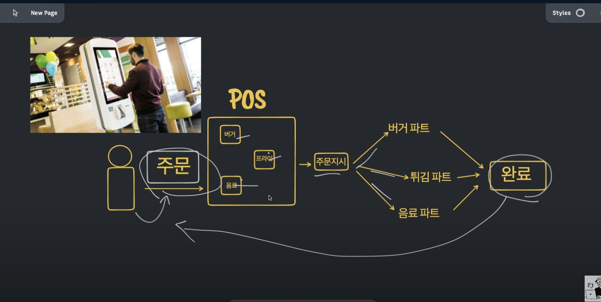
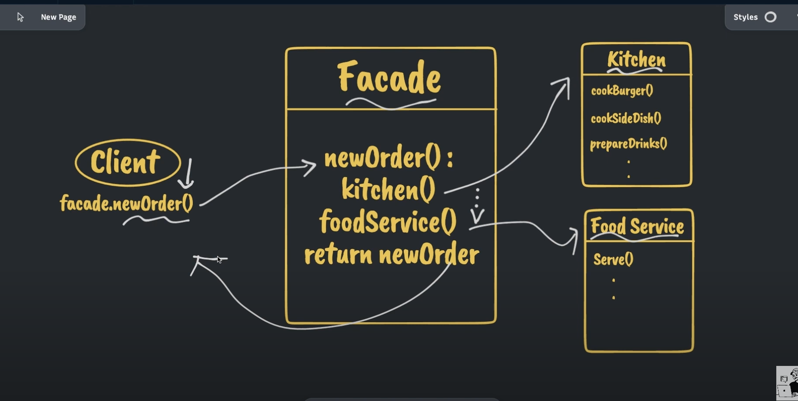
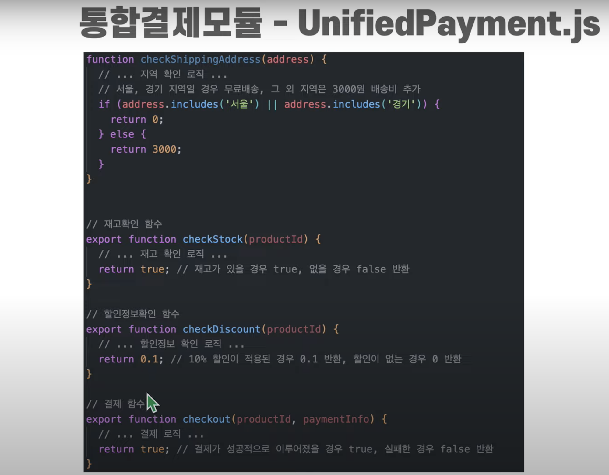
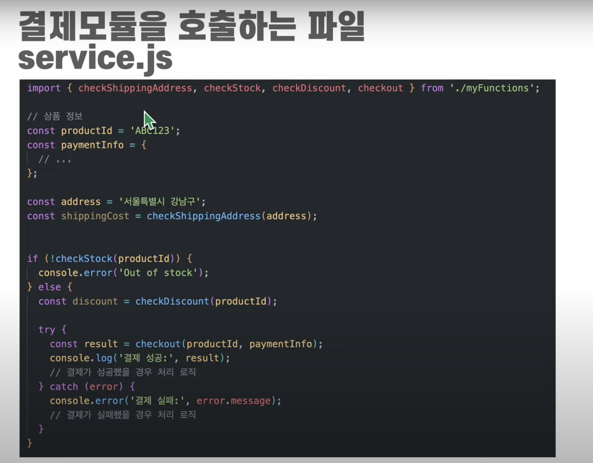
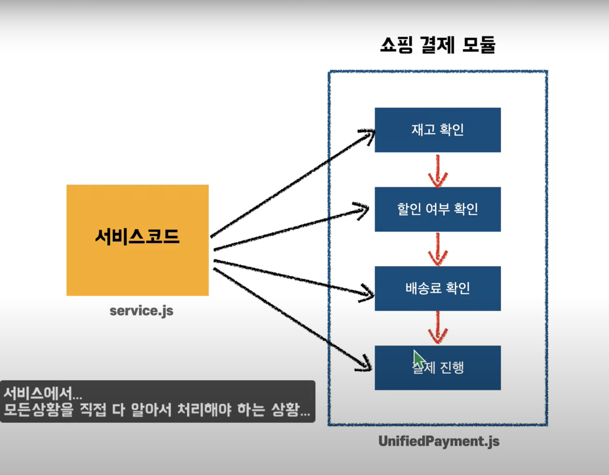
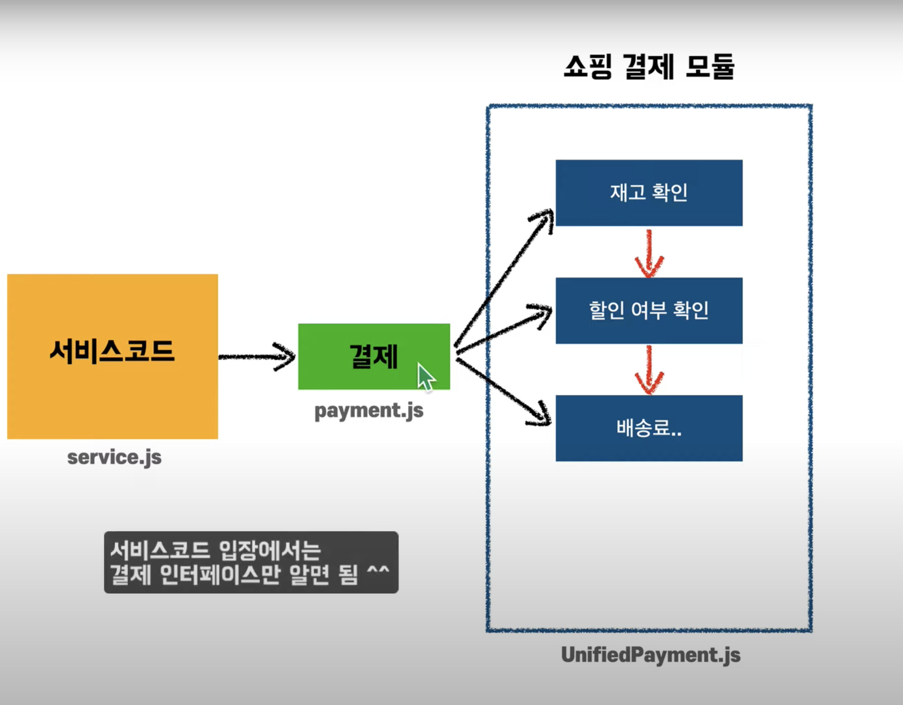
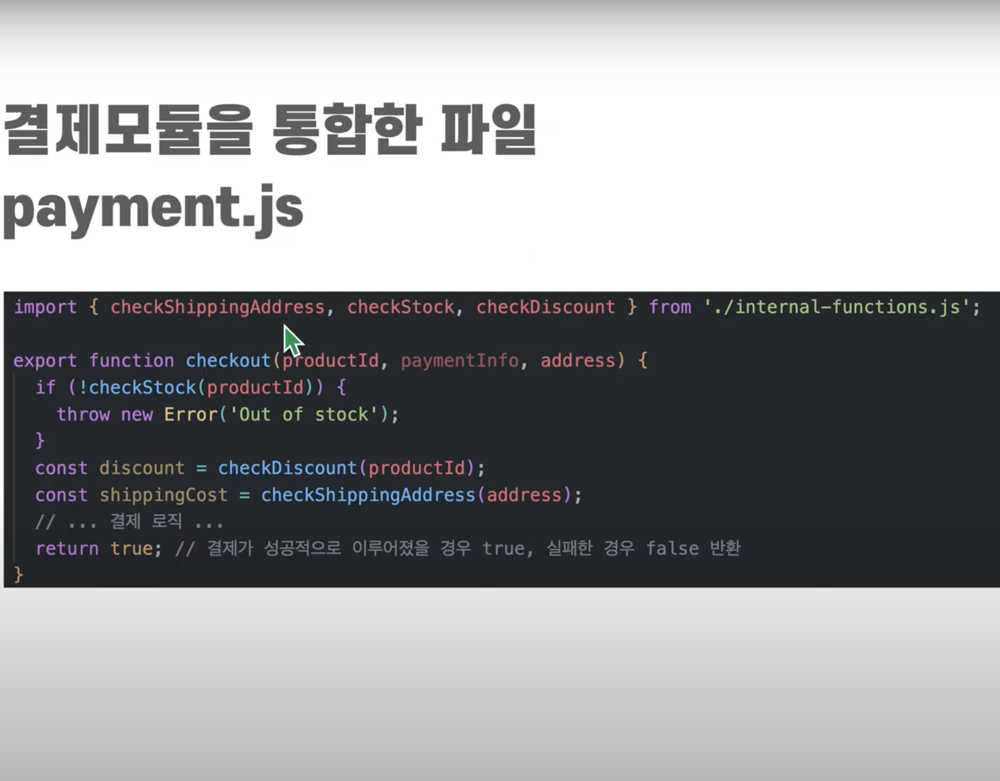
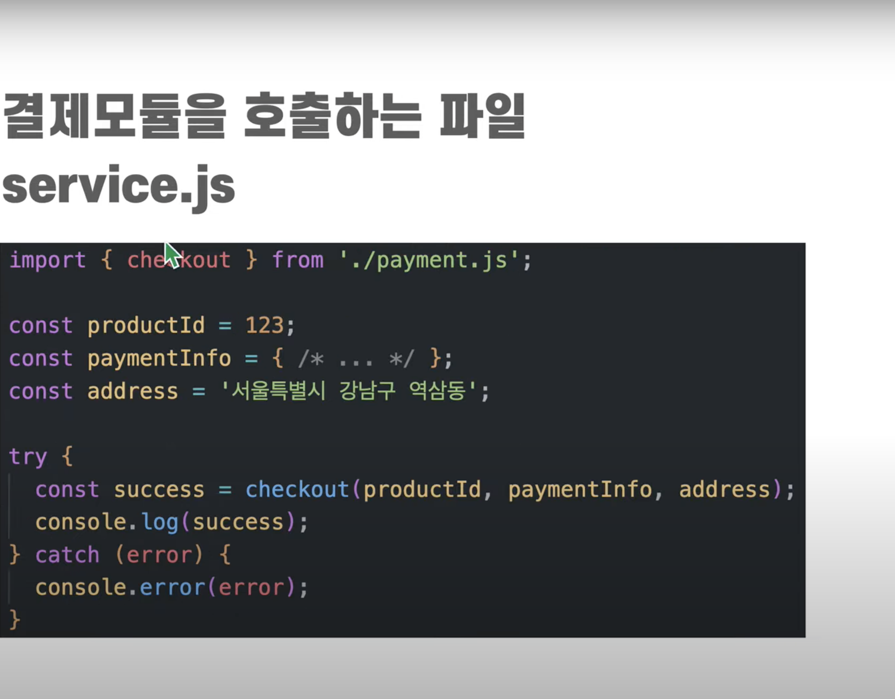
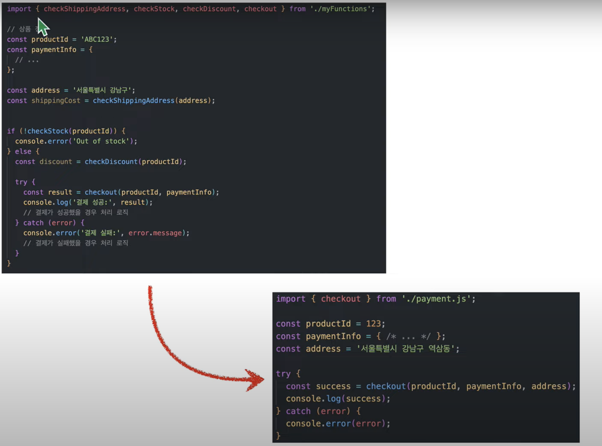

## Facade Pattern

- 복잡한 작업들을 하다 보면 알고리즘 만들게 되죠 알고리즘 만들면 하나의 함수에서 다 만드는 경우도 있는데

- 사실 복잡한 경우에는 다수의 함수 또 객체의 메소드들로 표현되면서 서로 막 호출하게 올라가고 의존성이 많이 생기게 된다

- 이 때 사용할 수 있는 것이 Facade Pattern으로 복잡한 로직을 단순한 인터페이스로 감싸서 코드를 간소화하는 패턴이다

- 여기서 말하는 인터페이스는 객체지향의 인터페이스 뿐 아니라 간단한 API 함수도 될 수 있다

- 요약하자면 자주 쓰이는 것들은 모아 가지고 함수 하나를 만들어 가지고 제공하는 개념으로 이해할 수 있다

- Facade 패턴의은 모든 언어에서 구현하능 하다

- 그리고 다음과 같은 상황에서 사용할 수 있다

  - 다른 복잡한 모듈 호출하는 부분에서 간단한 인터페이스를 만들어서 호출하는게 좋다

  - HTTP Request 분석할 경우에도 사용할 수 있다(백엔드에서 )

  - DB 접속시 또는 다른 api를 요청할 때 복잡한 과정으로 요청한다면 하나의 쉬운 api를 만들어서 활용할 수 있다

<br/>

- 정리하자면 Facade Pattern은 하나의 단순한 인터페이스를 통해서 시스템 안에 내포되어 있는 기능들,

- 프레임워크 아니면 뭐 기타 서브 클러스트 등에 쉽게 접근할 수 있도록 도와주는 개념이다

- Facade Pattern은 아래와 같은 특징을 갖는다

  1. 간략화된 인터페이스

  2. 직접적인 접근 제약

- 간략화된 인터페이스

  - 서브 시스템 이나 서브 클래스

  - 또는 프레임워크 등등 다수의 다른 기능들을 한 곳에서 간단하게 접근하게 해주는 방향을 제시 한다

- 직접적인 접근 제약

  - 이 인터페이스를 통해서 Facade 시스템의 큰 틀 그리고 주 목적을 이해할 수 있다.

  - 하지만 내부 동작 원리나 세부 구조 같은 경우는 쉽게 이해할 수가 없다.

  - 다시 말해서 클라이언트는 Facade 인터페이스 내부의 접근할 수도 없고 접근 할 이유도 없다.

  - 그래서 이 인터페이스를 통해서 클라이언트가 시스템 내부의 기능을 편하게 사용할 수 있도록 도와주는 그런 역할을 한다.

### 그림 예제



- 위 그림은 Facade 패턴을 설명하기 위한 햄버거 레스토랑 이다.

- 여기 햄버거 레스토랑의 이제 음식을 도와주는 POS 시스템 있다.

- 사용자가 주문을 할 때 POS로 음식을 고르고 **주문** 버튼을 누르면 이제 오더가 시작이 되고 이제 그걸 바탕으로 음식이 이제 만들어진다.

- 사용자가 주문을 하게 되면 그림에 있는 주문지시에 절차에 따라 키친 각 파트별로 주문이 들어가게 된다

- 버거면 버거 파트, 튀김이면 튀김파트, 음료면 음료파트로 주문이 들어가고 음식이 준비가 되면 주문이 완료가 되고 최종적으로 손님에게 전달이 된다

- 주문하는 입장에서는 간단하다. 그냥 메뉴를 고르고 POS에서 주문하기 버튼만 누르면 되기 때문이다

- 여기서 이제 **주문** 버튼이 바로 Facade 패턴의 핵심 키워드이다

- 클라이언트는 여기에서 **주문**이라는 버튼에만 신경을 쓰면 되고

- 그 이후에 제 발생하는 세세한 과정들

- 예를 들어 음식준비 아니면 먹음직 전달하기 이런 것들은 시스템 내부에서 이제 처리를 하게 되고

- 나중에 음식 준비가 완료되면 전달 받기만 하면 되는 것이다.

- 이게 기본적인 Facade 패턴의 개념이다

## Pseudo Code



- 코드를 보면 Facade 라는 인터페이스가 있고

- Kitchen과 Food Service 라는 서브 시스템이 있다

- 그래서 시스템의 흐름을 이제 전체적으 보면

- 이제 Client가 Facade 인터페이스의 `newOrder()`라는 함수를 호출한다. `(facade.newOrder())`

- 즉, `newOrder` 라는 함수를 통해 order를 전달을 하게 된다.

- 그럼 그 order 지시를 바탕으로 Facade는 이제 다른 서브 시스템 들의 인스턴스를 호출한다.

- `kitchen()`, `foodService()`가 호출되는 것을 Facade 인터페이스 내부에서 확인할 수 있다.

- 그래서 예를 들어 `kitchen()`에 음식 정보를 전달하고

- 그리고 음식이 완료되면 `foodService()`에게 전달하고

- 그리고 그 이후에 제 푸드 서비스가 최종적으로 완료되면 그 결과를 `return newOrder` 해서 클라이언트에게 order에 상응하는 결과를 돌려준다

- 대략적으로 이제 이런 흐름으로 인터페이스가 일을 처리 하고

- 클라이언트는 편하게 이제 원하는 결과물을 전달받을 수 있다

## 예제코드

- 위에서 정의한 Psudo Code를 나타내면 아래와 같다

```js
class Kitchen {
  cookBurger() {
    console.log("cooking burger");
  }

  cookSide() {
    console.log("cooking side dishes");
  }

  prepareDrinks() {
    console.log("preparing drinks");
  }
}

class FoodService {
  serve() {
    console.log("Order ready, serving food now");
  }
}

class RestaurantFacade {
  newOrder() {
    const kitchen = new Kitchen();
    kitchen.cookBurger();
    kitchen.cookSide();
    kitchen.prepareDrinks();

    const foodService = new FoodService();
    return foodService.serve();
  }
}
```

- 첫번째 클래스는 Kitchen이다

- 서브 시스템 또는 서브 클래스로 구분을 할 수 있고

- 이 클래스 내에서는 3가지 함수들이 있다

- 두번째는 FoodService 클래스로 역시 서브 시스템 또는 서브 클래스로 구분할 수 있다

- 그래서 여기서 있는 serve 라는 함수가 음식 주문이 완료가 되면 이제 손님에게 전달하는 마지막 단계의 역할을 한다

- 마지막으로 RestaurantFacade 클래스는 클라이언트와 인터페이싱을 직접하는 클래스로

- newOrder 라는 함수를 통해서 오더 지시를 받고

- kitchen, foodService 와 같은 서브 시스템을 통해서 주문 처리를 한다

- 그리고 마지막으로 완성된 주문을 클라이언트에게 전달을 하는 역할을 한다.

- newOrder 함수를 보면 앞서 Facade 패턴의 특징으로 언급한 것 처럼

- 간결한 인터페이스를 제 클라이언트에게 제공을 하고 그 안에 이제 복잡한 처리과정은 해당 함수에서 한번에 해결을 한다

- 아래와 같이 인스턴스를 작성하고 코드를 실행해본다

```js
const facade = new RestaurantFacade();
facade.newOrder();
```

- 콘솔창을 통해서 각각의 서브 클래스가 실행되는 것을 확인할 수 있다

- 이처럼 Facade 패턴은 매우 심플하고 또 쉽게 다수의 서브 클래스 또는 인터페이스등을 한 클래스에서 관리할 수 있게 도와준다

<br/>

## 결제 모듈 에제

- 결제 모듈을 또 다른 예시로 들 수 있다

- 쇼핑몰이라고 가정을 하면,

  - 1. 재고 확인

  - 2. 할인 여부 확인

  - 3. 배송료 확인

  - 4. 결제 진행

- 이렇게 진행되는 파일이 하나 있다고 가정하면

- 네 가지가 순차적으로 진행하는 프로세스를 가지고 있다.

- 쇼핑 결제 모듈 (UnifiedPayment.js)

  - 재고 확인 -> 할인 여부 확인 -> 배송료 확인 -> 결제 진행

### Pseudo Code

- Pseudo 코드로 짜보면 아래와 같이 나타낼 수 있다



- 첫번째 배송료에 관한 checkShippingAddress 함수를 포함해서 총 4가지 함수가 있다

- 독립적으로 되어 있어서 아직까지 서로 의존하지는 않고 있다

- 이렇게 정의된 함수들을 아래처럼 service.js 라는 파일에서 불러와서 사용하다고 하자



- 메인 로직을 보면 전체가 함수로 되어 있지도 않고 좀 복잡해 보인다

- 배송료 확인도 하고 (`shippingCost`)

- 재고가 있는지 확인해야 되고 이렇게 비즈니스 로직을 처리하는게 당연한 거 아닌가라고 생각을 할 수가 있다

- 이 코드를 아래와 같은 그림으로 나타낼 수 있다



- 서비스 코드가 쇼핑 결제 모듈에 해당하는 함수들을 가져오는 방식은

- 각각 모두 다 하나씩 다 일일이 확인을 해주어야 한다

- 각각의 어떤 함수 이름과 어떤 파라미터를 쓰는지 또 이거에 그 처리되는 순서는 무엇인지를

- 서비스 코드에서 다 알고 있어야 되는 것이다

- 즉, 너무 많은 걸 알게 되는 것이다

- 이걸 좀 추상화시켜서 아래처럼 간단하게 중간에 대표적인 결제를 처리해 주는 모듈를 하나 만들어주는 것을 통해서 Facade 패턴을 활용할 수 있다



- 그렇게 되면 결제 모듈이 그림과 같이 세 가지를 해주는 것이다

- 그러면 서비스 코드는 결제모듈에 해당하는 payment.js만 쉽게 확인을 해주면 되는 것이다

- 중간에 있는 결제 모듈(payment.js) 을 한번 확인해 보면 아래와 같다



- 배송료, 재고, 할인율 세 함수를 가져와서 어떤 비즈니스 로직을 처리를 해주는 함수를 만들어준다

  - 즉 결제 진행을 해당 함수에서 처리한다

- 그리고 서비스 코드를 확인하면 아래와 같다



- 서비스 코드는 아까보다 더 간단해져서 결제 모듈만 가져오면 된다

- 결제 모듈에서 만든 checkout 함수만 불러오면 되기 때문에

- 서비스 코드에서 더 이상 배송료, 재고, 할인율과 같은 것을 대해서 확인을 하지 않게 되는 것이다

- 아래와 같이 이전 코드와 비교해서 보면 코드가 간결해진 것을 확인할 수 있다



### 장점

1. 같은 코드를 반복적으로 작성하는 것을 방지한다

2. 한 곳에서 다른 서브 클래스 때를 컨트롤 하기 때문에 나중에 유지보수를 하게도 좀 더 수월하다

3. 한눈에 의존 관계의 같은 것을 파악할 수 있다

---

### Reference

- [개발자가 알아야할 디자인패턴 | ep4. Facade Pattern | 자바스크립트 퍼사드 패턴](https://www.youtube.com/watch?v=RNE1zfECaac)
- [모든 언어에서 유용하고 아주 쉬워요~ (일상의 디자인 패턴 4편)](https://www.youtube.com/watch?v=FSOYzuwu5cE&list=PLBQiFVHp3AamzWP7_f-rz9Fmun4DOGRIW&index=4)
