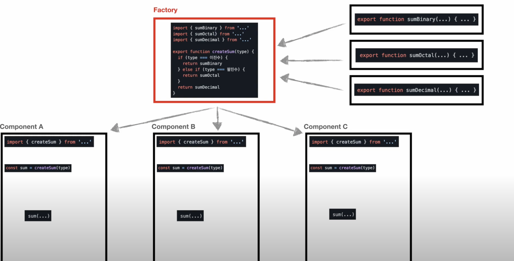
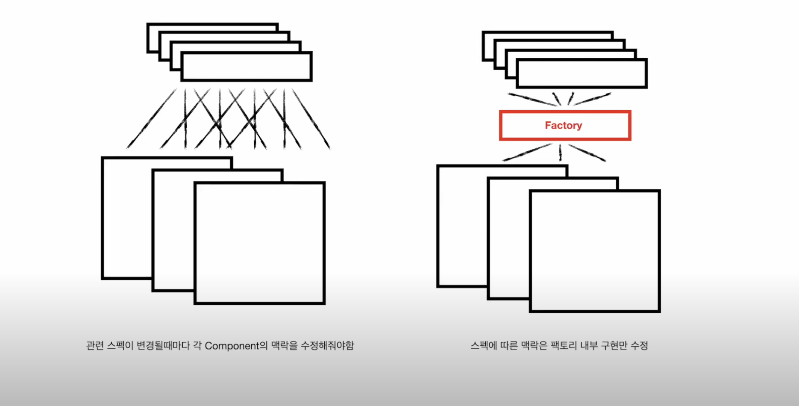
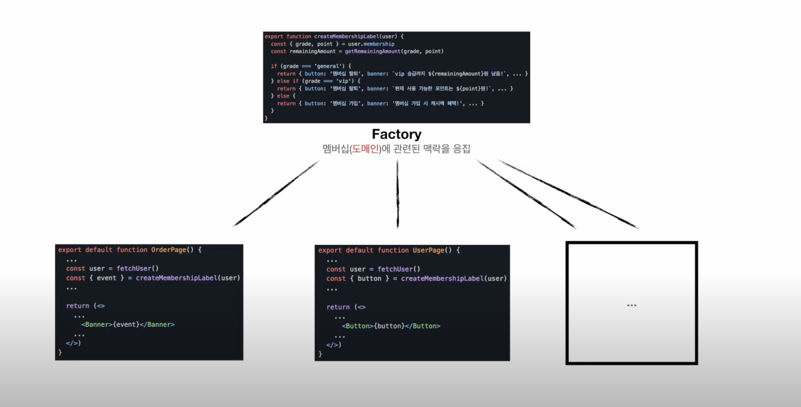
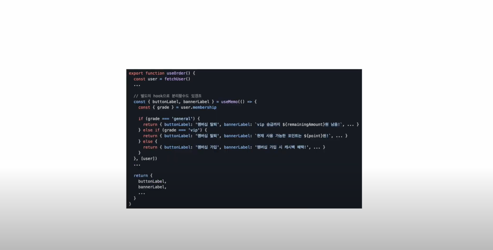
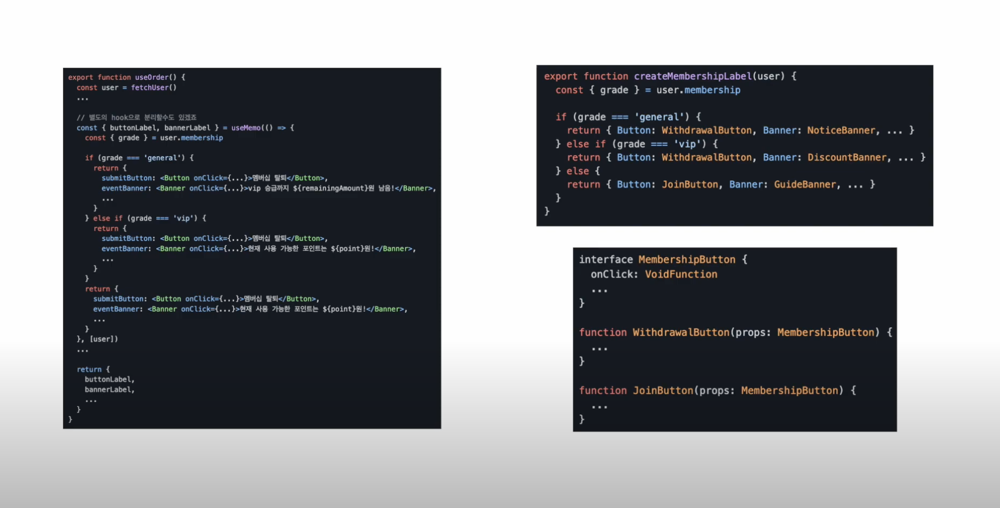

## Factory Pattern

- 팩토리는 **객체, 함수, 값**을 찍어낼 수 있는 (반환하는) 공장이다.

- 그 공장은 함수가 될 수도, 클래스가 될 수도 있다.

- 특정 상황에 어떤 **객체, 값, 함수**를 사용할지에 대한 구체적인 로직을 추상화하고

- 관련된 로직을 하나의 함수(팩토리)로 응집할 수 있게 도와준다

- 예를들어, Component A, Component B, Component C가 있다고 하자

- 이 때 어떤 덧셈 기능 넣어달라는 요구가 있다고 하자

- 각 컴포넌트에서 구현할 수 있지만 재사용성을 위해 별도의 모듈로 만든 다음 다음과 같이 각 컴포넌트에서 import 해서 사용한다고 하자

```js
import { sumDecimal } from "...";
```

- 여기에 추가적으로 2진수 덧셈 기능이 추가된다고 하자

- 그렇다면 아래처럼 각 컴포넌트에서 import 해서 조건문을 통해서 처리할 수 있다

```js
import { sumDecimal } from '...';
import { sumBinary } from '...';

...

if(이진수){
  sumBinary(...)
}else{
  sumDecimal(...)
}
```

- 여기서 또 다른 요구사항인 8진수 덧셈 기능이 추가된다고 하자

- 그렇다면 위에서 처럼 8진수 덧셈을 위한 함수를 정의하고 컴포넌트에서 import 해준 다음에 조건문에 해당 분기를 추가해주어야 한다

- 그러다보면 이게 맞나? 라는 생각이 들 때가 있는데 이 때가 바로 팩토리 패턴을 적용할 적기이다

- **비슷한 행위**를 하는 것들이 **조건**에 따라 차이가 나는 상황이다

- 이를 별도의 함수를 분리해줄 수 있는데, 이 함수가 바로 팩토리가 된다

- 바로 아래처럼 팩토리 패턴을 적용할 수 있다

- Factory 역할을 하는 함수를 정의하고 해당 함수를 필요한 곳에서 import 해서 사용한다



- 결론적으로 팩토리 패턴은 아래와 같은 장점을 가지게 되고

- 응집도가 높은 구조를 갖게 된다



- 아래처럼 단순히 조건에 따른 분기 처리를 할 뿐 아니라 도메인에 따른 기능 정의를 응집하는 용도로 사용 가능하다.



- 또 다른 예시로는 아래처럼 Custom Hook을 사용해서 조건에 따른 처리를 할 수도 있다

  - 여기서는 hook이 팩토리 역할을 한다



- 아래처럼 컴포넌트 수준에서도 적용이 가능하다

- 아래 예제의 왼쪽 예시처럼 컴포넌트 수준의 팩토리로 사용할 수도 있고

- 오른쪽 처럼 컴포넌트 생성 함수 수준의 팩토리로도 응용할 수 있다

- 만약 타입스크립트를 사용한다면 props에 대한 interface를 맞춰주어야 한다



- 즉, 팩토리 패턴은 조건에 따라 달라지는 비슷한 맥락을 갖는 행위를 한 곳에 응집 시킬수 있는 아이디어

<br/>

- 아래 코드는 팩토리 함수를 사용하는 예시로 Animal을 상속하는 Cat과 Dog라는 클래스가 있다

- 팩토리 함수를 만들고 고양이 또는 강아지를 만들어 달라고 인자를 전달하면 해당 인스턴스를 만들어준다

```js
class Animal {
  speak() {
    console.log("speak");
  }
}

class Cat extends Animal {
  speak() {
    console.log("Cat");
    super.speak();
  }
}

class Dog extends Animal {
  speak() {
    console.log("Dog");
    super.speak();
  }
}

// 팩토리 함수
const factory = (animal) => {
  if (animal === "Cat") {
    return Cat();
  } else if (animal === "Dog") {
    return Dog();
  }
};

const cat = factory("Cat");
cat.speak();

const dog = factory("Dog");
dog.speak();
```

- 팩토리를 클래스로 만들 수도 있다

```js
class Factory {
  factory(animal) {
    if (animal === "Cat") {
      return Cat();
    } else if (animal === "Dog") {
      return Dog();
    }
  }
}

const factory = new Factory();

const cat = factory.speak("Cat");

const dog = factory.speak("Dog");
```

- 또 다른 예시는 아래와 같다

- 아래 코드는 신발을 만드는 팩토리 클래스가 있는 팩토리 패턴이다

```js
// 신발 공장 Base Class
class Shoe {
  constructor(attrs) {
    this._attrs = attrs || {};
  }

  getName() {
    return this_.attrs?.name;
  }

  getSize() {
    return this_.attrs?.size;
  }

  getBrand() {
    return this.constructor?.name; // 해당 클래스의 이름
    // 아래 Nike 클래스에서 Shoe 클래스를 상속 후
    //  해당 함수 호출하면 Nike 출력된다
  }
}

// 세 클래스 모두 신발 공장 Base Class를 상속받는다
class Nike extends Shoe {}
class Puma extends Shoe {}
class Adidas extends Shoe {}

const data = [
  { type: "Nike", attrs: { name: "SB", size: 300 } },
  { type: "Puma", attrs: { name: "Jada", size: 290 } },
  { type: "Adidas", attrs: { name: "Super Start", size: 270 } },
  { type: "Nike", attrs: { name: "Airfore", size: 260 } },
];

// Factory Class
class ShowFactory {
  // 각 신발 브랜드의 레퍼런스를 갖고 있다.
  // 조건 로직을 담당한다 (팩토리 패턴에서는 조건 로직이 필요)
  // switch 문을 사용하기도 하고 이렇게 mapping을 할 수 도 있다.
  typeMap = {
    nike: Nike,
    puma: Puma,
    adidas: Adidas,
  };

  create(props) {
    try {
      const Brand = this.typeMap[props?.type?.toLowerCase()]; // 어떤 타입의 클래스를 적용할 것인지
      return new Brand(props.attrs);
    } catch (e) {
      console.log("error creating new shoes", e);
    }
  }
}

const factory = new ShoewFactory(); // 팩토리 인스턴스 생성

const nike1 = factory.create({
  type: "Nike",
  attrs: { name: "Cortez", size: 265 },
});

console.log(nike1);
console.log(nike1.getBrand());
console.log(nike1.getSize());

// 팩토리 패턴은 map과 사용되기도 한다
const items = data.map((item) => factory.create(item));
console.log(items);
```

<br/>

- 아래 예시는 React에서 Lazy Loading에 팩토리 패톤을 적용하는 예시이다

- 최초 페이지 로드가 되고, 모든 컴포넌트의 마운트가 끝났을 때 모달 코드를 로드한다

- 아래 코드에서 import가 동작하는 방법은 다음과 같다

  - 여기서 사용하는 import는 우리가 흔히 사용하는 `import 'module'` 또는 `import * from 'module'` 이 아닌 `import('module')` 이 표현식이다

  - `import('module')` 는 빌드 시에 모듈을 import 하는 것이 아닌, 런타임 시에 동적으로 모듈을 import 하며,

  - 실제 module를 바로 리턴하는게 아니라 해당 모듈을 담고 있는(resolve 하는) Promise 객체를 반환한다

  - 동적으로 모듈을 가져도는 동작은 시간이 소요되는 동작이기 때문에 이걸 비동기로 처리하기 때문.

  - 즉, 다음과 같이 사용해야 된다

    ```js
    import("module").then((module) => {
      // module을 사용하여 원하는 동작
    });
    ```

  - 하지만 여기서 저 module이 단순 유틸성 함수라면 상관없지만, 우리같이 컴포넌트라면 import가 된 시점에 setState 를 하여 React의 Render Cycle로 가져올 필요가 있고

  - 그 과정을 쉽게 해주는 것이 React.lazy와 React.Suspense 이다

- 그리고 미리 import를 해두면, 미리 해당 모듈을 네트워크를 통해 불러오게 되고 (사용하지는 않더라도)

- 다른 곳에서 lazy 안에서 import를 할 때는 이미 네트워크 상에서는 로드된 데이터를 바로 사용할 수 있으므로 시간이 단축된다.

- 즉, 단순히 컴포넌트를 동적으로 import 하면 Promise를 통해 컴포넌트 객체가 전달된다.

- 이때 리액트의 컴포넌트를 렌더링 할 때는 Promise를 통해 받아온 컴포넌트 객체를 Promise 밖으로 꺼내야 합다.

- 이것을 도와주는 것이 바로 lazy 함수이다.

- 정리하면, 동적 로딩은 import 함수만으로 충분하다.

- 다만, 비동기한 컴포넌트 라이프사이클 내에서 동적 로딩한 컴포넌트를 제대로 전달받기 위해서는 lazy 함수를 사용해야 한다.

- 물론, 본인이 lazy와 같은, Promise로 받은 컴포넌트 객체를 밖으로 빼는 함수를 직접 구현해도 된다 (이것은 일반적인 API(비동기) 데이터를 로드하는 것과 비슷하다.)

```js
const LazyImageModal = lazy(() => import("./components/ImageModal"));
// Code Splitting을 통해 코드가 분할되어 있다

function App() {
  const [showModal, setShowModal] = useState(false);

  useEffect(() => {
    import("./components/ImageModal");
    //import를 해두면, 미리 해당 모듈을 네트워크를 통해 불러오게 된다 (사용하지는 않더라도)
    // 그렇기 때문에 LazyImageModal를 마운트 할 때 네트워크를 통해서 필요한 코드를 다운받지 않아도 된다
  }, []);

  return (
    <div className="App">
      <Header />
      <InfoTable />
      <ButtonModal
        onClick={() => {
          setShowModal(true);
        }}
      >
        올림픽 사진 보기
      </ButtonModal>
      <SurveyChart />
      <Footer />
      <Suspense fallback={null}>
        {showModal ? (
          <LazyImageModal
            closeModal={() => {
              setShowModal(false);
            }}
          />
        ) : null}
      </Suspense>
    </div>
  );
}

export default App;
```

- 지금을 단일 컴포넌트르 미리 import 해주지만 만약 여러 컴포넌트를 preload 해줄 필요가 있다면 매번 import를 직접 써주는 것이 번거롭다

- 이 때 팩토리 패턴을 사용한다

- 팩토리 패턴을 적용하면 아래와 같이 코드를 수정할 수 있다

- 코드에 대한 설명은 다음과 같다

```js
// 단순 컴포넌트 동적 로딩 코드 (이렇게 하면 Suspense 안에서 해당 컴포넌트가 사용되는 순간 import가 됩니다.)
const LazyImageModal = lazy(() => import("./components/ImageModal"));

// 위 코드만 쓰게되면 단순 코드 분할 및 지연 로딩 일뿐 preloading을 한 건 아니죠?
// 그래서 해당 컴포넌트가 실제 사용되기 이전 시점에 import(즉, preload)하기 위해서는
// 적절한 시점에 단순 컴포넌트를 import하는 코드가 필요합니다.

// 그 작업을 해주는 코드를 펙토리 패턴 적용 전에는 useEffect에서 직접 import 구문을 호출해줬는데,
// 이제는 미리 import 구문을 해당 컴포넌트에 preload라는 커스텀 속성을 만들어 넣어줬습니다.

// 이렇게 하면, useEffect 안에서 직접 import를 호출할 필요없이,
// LazyImageModal.preload();
// 이렇게만 호출하면 됩니다.
LazyImageModal.preload = () => import("./components/ImageModal");
```

- 즉, lazy(() => import()) 를 하는 순간 컴포넌트가 import 되는 것이 아니다.

- 해당 코드는 특정 컴포넌트(또는 모듈)을 동적으로 로드 하겠다는 표시이고 번들 파일에서 분할(코드 분할)한다.

- 그리고 Suspense 안에서 해당 모듈이 사용되는 순간 분할된 코드를 로드하여 실행을 하는 방식입니다.

- 하지만, 우리가 원하는건 사용되는 순간 분할된 코드를 로드하는 것이 아닌, 사용하기 전 시점에 미리 코드를 로드하여 사용하는 순간에는 딜레이(분할된 코드가 다운로드되는 시간)없이 사용하고자 하는 것이고

- 그것을 위해서는 동적으로 파일을 로드하는 코드인 import 구문을 직접 호출해주어야 한다.

- 이것은 lazy에서 호출하는 import와 다르다.

- lazy 안의 import 구문은 해당 컴포넌트가 사용되는 시점에 해당 코드를 자동으로 로드하기 위해 사용되는 코드이고, 지금 얘기하는 직접 호출하는 import는 해당 컴포넌트가 사용될지와 상관없이 그냥 로드하는 것으로.

- 이렇게하면, 해당 코드는 다운로드되고 시간이 지나 실제 해당 코드를 사용하는 순간이 오면 굳이 새로 다운로드 하지 않아도 기존에 다운로드된 코드를 그대로 활용할 수 있게된다.

- 즉, 딜레이가 사라지는 것

- 코드에서 LazyImageModal.preload 에 import 구문을 넣는 것은 그것을 위한 것이고,

- useEffect에서 LazyImageModal.preload()를 호출하는 것은 preload를 위해 import 구문을 직접 실행하여 코드를 미리 로드해 두기 위함이다.

- 전체 코드는 다음과 같다

```js
// 팩토리 역할
// 단순 컴포넌트 동적 로딩 코드 (이렇게 하면 Suspense 안에서 해당 컴포넌트가 사용되는 순간 import가 된다)
function lazyWithPreload(importFunction) {
  const Component = React.lazy(importFunction);
  // 이전의 아래 코드와 같다
  // 코드 스플리팅 역할
  // const LazyImageModal = lazy(() => import('./components/ImageModal'));

  // 즉 아래 코드와 동일하다
  // const Component = lazy(() => import('./components/ImageModal'));

  Component.preload = importFunction; // () => import('./components/ImageModal')
  // preload라는 속성을 추가한다
  // useEffect hook에서 호출하기 위해 추가

  return Component;
}

const LazyImageModal = lazyWithPreload(() => import("./components/ImageModal"));

function App() {
  const [showModal, setShowModal] = useState(false);

  useEffect(() => {
    LazyImageModal.preload();
    // import('./components/ImageModal')와 동일하다
    // 똑같이 마지막에 컴포넌트 로드되는 것을 확인할 수 있다
  }, []);

  return (
    <div className="App">
      <Header />
      <InfoTable />
      <ButtonModal
        onClick={() => {
          setShowModal(true);
        }}
      >
        올림픽 사진 보기
      </ButtonModal>
      <SurveyChart />
      <Footer />
      <Suspense fallback={null}>
        {showModal ? (
          <LazyImageModal
            closeModal={() => {
              setShowModal(false);
            }}
          />
        ) : null}
      </Suspense>
    </div>
  );
}

export default App;
```

<br/>

### 장점

- 팩토리 패턴의 장점으로는

- 복잡한 오브젝트들의 생성 과정을 클라이너트가 직접 다룰 필요가 없다

- 복잡한 과정을 모두 팩토리에 숨겨놓고 클라이언트는 간단하게 팩토리에 오브젝트를 만들어달라고 요청하면, 팩토리는 요청한 인스턴스를 리턴해준다

- 클래스 간의 의존도가 낮기 때문에 확장이 쉽고 추후에 유지 보수가 용이하다

### 단점

- 팩토리 패턴의 단점으로는

- 단순히 조건문이 있다는 이유로 전혀 다른 맥락을 갖는 행위들을 팩토리화 한다거나

- 유사한 맥락을 갖는 행위를 무조건 하나의 팩토리에 몰아 넣음으로써 오히려 팩토리 전체에 의존되어

- 팩토리를 수정했을 때 사이드 이펙트를 감당할 수 없게 되는 위험성도 있다

## Reference

- [Design pattern, Factory Pattern, 디자인패턴, 팩토리 패턴](https://www.youtube.com/watch?v=AmwEIt0vhxA&t=1s)

- [개발자가 알아야할 디자인패턴 | ep2. Factory Pattern | 자바스크립트 팩토리 패턴](https://www.youtube.com/watch?v=L78FbkyOcyk)

- [프론트엔드에 디자인패턴 끼얹기1 - 팩토리 패턴(factory pattern)](https://www.youtube.com/watch?v=eSLrZbPHgoI&t=100s)

- [Lazy Loading - 팩토리 패턴](https://github.com/dkmqflx/web-performance-optimization-inflearn/blob/master/part1/section2.md)
