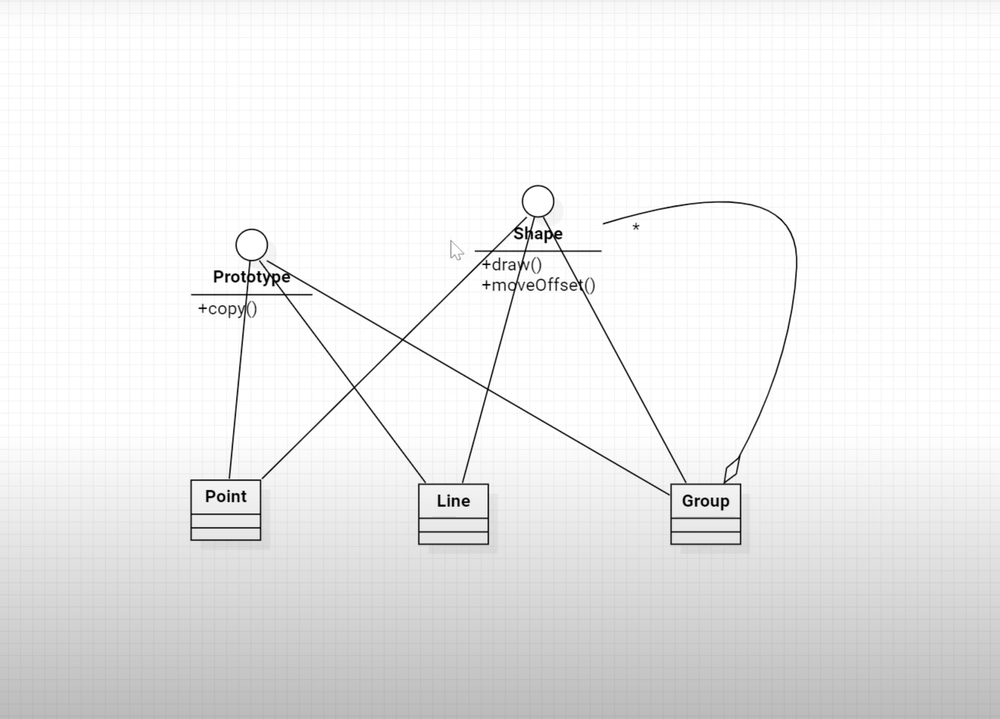
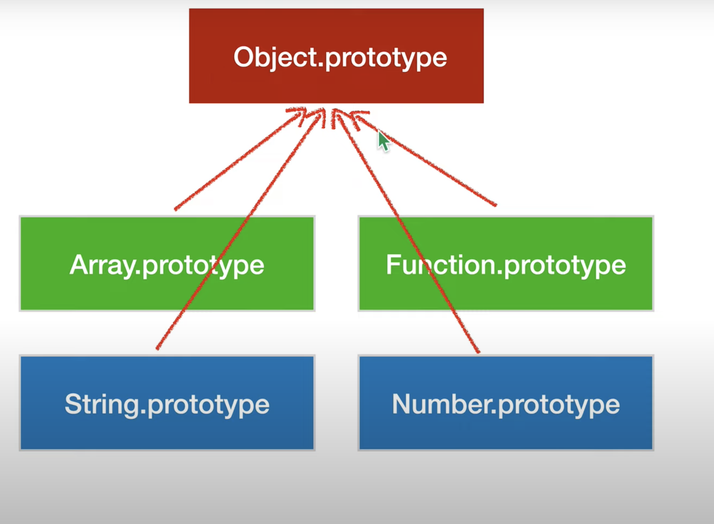

## Prototype Pattern

- 프로토타입 패턴은 객체를 생성하는 패턴

- 일반적으로 객체의 생성은 클래스 이름 앞에 new 키워드를 사용해서 생성되낟

- 하지만 프로토타입 패턴의 경우 new와 클래스의 이름이 아닌 생성된 객체를 통해서 또 다른 객체를 생성한다

- 이때 원본객체와 복사된 객체는 서로 어떠한 상태값도 공유하지 않고 독립적이다

- 원본 객체의 상태 값을 깊은 복사 방식으로 복사본의 상태값으로 할당해야 한다

- 즉, 실행 중에 생성된 객체로 다른 객체를 생성하는 패턴으로

- Prototype으로 만든 객체의 상태를 변경해도 원본 객체의 상태는 변경되지 않도록 해야 한다 (Deep Copy: 깊은 복사)

## 다이어그램

- 아래는 프로토타입 패턴의 다이어그램의 예시이다



- 먼저 Prototype 인터페이스는 프로토타입 패턴을 위한 인터페이스로 이미 생성된 객체로부터 또 다른 새로운 객체를 생성해내는 copy라는 api를 가지고 있다

- 그리고 Shape 인터페이스는 도형에 대한 api를 가지고 있는데, 구체적인 도형에 대한 클래스는 Porint, Line, Group 이다.

- 이 세 개의 클래스는 모두 Prototype과 Shape 인터페이스를 구현하고 있다.

- Point 클래스는 특정 지점에 대한 포인트 좌표를 의미하고

- Line은 두 개의 포인트 객체로 표현되는 선을 의미한다

- 그리고 Group은 Shape 인터페이스의 객체를 여러 개 가실 수 있는 클래스로

- Shape 인터페이스와 호환되는 여러 개의 객체들을 이용해서 새로운 도형을 구성하기 위한 클래스이다

## 다이어그램 구현

- 아래 코드를 통해서 사각형에 대한 도형을 Group 클래스를 이용해서 만들어 볼 것이다

- 즉 사각형에 대한 구체적인 클래스가 없음에도 기존의 Point와 Line 클래스의 객체를 조합해서 새로운 사각형 객체를 생성해 낼 수 있다.

```ts
// Prototype 인터페이스

export default interface Prototype {
  copy(): this;
}
```

- 새로운 객체를 복사해서 생성하는 메소드로 반환타입은 this 이다.

- 이렇게 하면 자기 자신의 타입에 대한 객체를 변환시킬 수 있다

```ts
// Shape 인터페이스

export default interface Shape {
  draw(canvas: HTMLCanvasElement): this; // 실제 캔버스에 그려주는 메소드
  moveOffset(dx: number, dy: number): this; // 도형 전체를 일정한 거리만큼 이동시켜주는 메서드
}
```

- 두 메서드 모두 반환값을 반환 타입을 this 명시했는데 이렇게 하면 아기 자신에 대한 타입으로 객체를 반환시킬 수 있다

- 우선 Point 클래스를 정의한다

```ts
// Point.ts

import Prototype from "./Prototype";
import Shape from "./Shape";

export default class Point implements Prototype, Shape {
  // x, y 필드, 생성자를 통해서 추가
  constructor(private x: number, private y: number) {}

  // x, y 필드를 지정할 수 있는 메서드
  setX(v: number) {
    this.x = v;
    return this;
  }

  setY(v: number) {
    this.y = v;
    return this;
  }

  // x,y 필드 값을 얻을 수 있는 메서드
  getX(v: number) {
    return this.x;
  }

  getY(v: number) {
    return this.y;
  }

  // 새로운 Point 객체를 x, y 값으로 인자를 지정해서 생성하고 그 결과를 반환
  copy(): this {
    const result = new Point(this.x, this.y);
    return result as this;
  }

  draw(canvas: HTMLCanvasElement): this {
    const context = canvas.getContext("2d");
    context.beginPath();
    context.arc(this.x, this.y, 4, 0, 2 * Math.PI); // x,y좌표에 원을 그려준다
    context.fill();

    return this;
  }

  // x,y 좌표에 인자로 받은 이동 거리만큼 더해준다
  moveOffset(dx: number, dy: number): this {
    this.x += dx;
    this.y += dy;
    return this;
  }
}
```

- 다음은 Line 클래스이다

```ts
// Line.ts

import Prototype from "./Prototype";
import Shape from "./Shape";
import Point from "./Point";

export default class Point implements Prototype, Shape {
  // 선의 시작점과 끝점에 대한 필드 추가
  private pt1: Point;
  private pt2: Point;

  constructor(pt1: Point, pt2: Point) {
    // 새로운 Point 객체 생성
    // 복사본의 시작점, 끝점 변경해도 원본에 영향을 주지 않는다
    this.pt1 = pt1.copy();
    this.pt2 = pt2.copy();
  }

  // 시작점과 끝점에 대한 필드값을 설정할 수 있는 메서드
  setPt1(pt: Point): this {
    this.pt1 = pt.copy();
    return this;
  }
  setPt1(pt: Point): this {
    this.pt2 = pt.copy();
    return this;
  }

  // 시작점과 끝점에 대한 필드값을 얻을 수 있는 메서드
  getPt1() {
    return this.pt1;
  }

  getPt2(v) {
    return this.pt2;
  }

  // 구현해야하는 인터페이스 메서드 정의
  copy(): this {
    const result = new Line(this.pt1, this.pt2); // 시작점과 끝넘 객체 전달
    return result as this;
  }

  draw(canvas: HTMLCanvasElement): this {
    const context = canvas.getContext("2d");
    context.beginPath();
    context.moveTo(this.pt1.getX(), this.pt1.getY());

    // 시작점과 끝점을 이용해서 선을 그려준다
    context.lineTo(this.pt2.getX(), this.pt2.getY());
    context.stroke();
    return this;
  }

  moveOffset(dx: number, dy: number): this {
    // 선을 구성하는 시작점과 끝점의 위치를 이동시켜주고 있다
    this.pt1.moveOffset(dx, dy);
    this.pt2.moveOffset(dx, dy);

    return this;
  }
}
```

- 그리고 다음은 Group 클래스이다

```ts
// Group.ts

import Prototype from "./Prototype";
import Shape from "./Shape";
import Point from "./Point";

export default class Group implements Prototype, Shape {
  // Group 클래스 객체가 가질 수 있는 Shape 객체들을 저장할 수 있는 배열
  private shapes = new Array<Shape | Prototype>();

  // Group을 구성하는 도형 객체를 추가하는 메서드
  add(shape: Shape | Prototype): this {
    this.shape.push((shape as Prototype).copy()); // 깊은 복사
    return this;
  }

  // 구현해야하는 인터페이스 메서드 정의
  copy(): this {
    const result = new Group();

    // 원래 원본을 구성하는 모든 도형들을 새로운 Group에 add 메서들 호출해서 추가한다
    this.shapes.forEach((shape) => {
      result.add(shape);
    });
    return result as this; // 새로운 Group 객체 반환
  }

  draw(canvas: HTMLCanvasElement): this {
    this.shapes.forEach((shape) => {
      (shape as Shape).draw(canvas);
    });
    return this;
  }

  moveOffset(dx: number, dy: number): this {
    this.shapes.forEach((shape) => {
      (shape as Shape).moveOffset(dx, dy);
    });
    return this;
  }
}
```

- 그리고 아래처럼 canvas를 선언해준다

```html
<canvas width="600" height="600"> </canvas>
```

- 이제 위에서 작성한 클래스들을 사용해서 canvas에 그릴 수 있다

```ts
// index.ts

const domCanvas = document.querySelector("canvas");

const pt1 = new Point(100, 100);
pt1.draw(domCanvas);

const pt2 = new Point(200, 100);
pt2.draw(domCanvas);

// 위 두 점을 이용한 하나의 선 객체 생성
const line1 = new Line(pt1, pt2);
line1.draw(domCanvas);

// 사각형 도형 생성, 네개의 선으로 생성되어 있다
const pt3 = new Point(200, 200);
const pt4 = new Point(100, 200);

const line2 = new Line(pt3, pt3);
const line3 = new Line(pt3, pt4);
const line4 = new Line(pt4, pt1);

const rect = new Group(); // Group 클래스 객체 생성

rect.add(line1).add(line2).add(line3).add(line4); // 생성한 라인 추가
rect.draw(domCanvas);

// 이렇게 생성한 정사각형을 복사해서 새로운 객체를 생성한다
const cloneRect = rect.copy();
// 그리고 생성한 객체동 후 출력, 원본에 영향을 주지 않는다
cloneRect.moveOffset(200, 200);
cloneRect.draw(domCanvas);
```

- 정리해보면 Prototype 패턴은 객체를 클래스에 이름으로 생성하지 않고 실행 중에 생성된 객체를 통해서 동일한 상태값으로 새로운 객체를 생성하는 패턴

- 원본 객체에 대한 깊은 복사를 사용해서 변경에 대해 서로 다른 쪽에 영향을 주지 않는다.

- 아울러 앞서 본 예제에서 사각형 모양의 객체를 생성해 보았는데 클래스 다이어그램에서는 그 사각형에 대한 클래스가 어디에도 존재하지 않는다

- 대신 기존의 클래스들의 객체를 조합해서 사각형 객체를 생성했는데 이처럼 새로운 클래스를 추가하지 않고도 새로운 형태의 객체를 생성할 수 있는 상황을 만들어 낼 수 있다면

- Prototype 패턴을 적용해서 유연성을 크게 발휘할 수 있습니다

## Prototype in JavaScript

- 아래처럼 배열이 1000개 있다고 가정해보자

```js

const arr1 = []
const arr2 = []

...

const arr1000 = []

arr1.push()
arr2.push()
arr1000.push()

```

- 각각의 배열은 push라는 함수를 호출하고 있는데

- arr1 부터 arr100까지 모든 배열 객체가 push 함수가 있고

- 이 외에도 각 배열 객체는 배열 객체가 가질 수 있는 여러 메소드가 있다

- 이렇게 되었을 때의 문제는 객체마다 함수를 중복되게 가질 수 있다는 것이고

- 그 결과 메모리 낭비로 이어질 수 있다

- 그래서 자바스크립트는 Array.prototype 라는 객체 안에

- 앞의 각각의 배열객체가 중복으로 가질 수 있는 객체들을 모두 다 모아둔다

- 그래서 각 배열 객체가 push 함수를 호출하면, 각각의 객체에 push 함수를 정의하고 호출하는 것이 아니라

- Array.prototype 객체 안에 있는 push 함수를 호출하는 것이다

- 이 방법은 앞의 모든 객체에 함수를 정의하는 것 보다 효율적이다

- 자바스크립트는 이러한 프로토타입이라는 개념을 가지고 구축이 되어 있다.

- Prototype (원형 또는 모델)

  - 즉, 프로토타입은 어떠한 객체의 공통적인 요소(함수)의 집합이라고 이해할 수 있다

- 함수에도 프로토타입이 있다 (Function.prototype)

- 아래 코드를 보면 bind 함수를 사용한다

```js
const foo = () => console.log("hello world");
foo.bind();
```

- 따라서 함수는 객체인가하고 생각할 수 있는데

- 함수의 prototype에 있는 bind를 호울하는 것이다

- 자바스크립트에 있는 객체들을 이렇게 프로토타입을 가지고 있다고 볼 수 있다

- 그리고 아래처럼 이러한 프로토타입은 최상위 프로토타입 Object.prototype이라는 것을 프로토타입으로 가진다



- 실제로 아래처럼 프로토타입에 접근할 수 있다

```js
const foo = () => console.log("hello world");

foo.__proto__; // Function 프로토타입
foo.__proto__.__proto__; // 최상위 Object 프로토타입
```

- 아래와 같이 prototype을 사용할 수 있다

```js
// 생성자 함수
function MyClass(value) {
  this.value = value;
}

MyClass.prototype.getValue = function () {
  return this.value;
};
MyClass.prototype.setValue = function (value) {
  return this.value;
};

new MyClass(111).getValue();
new MyClass(112).getValue();
new MyClass(113).getValue();
```

- new MyClass()를 통해서 객체를 생성하고 getValue()를 호출한다

- 3개의 객체를 만들었기 때문에 getValue()도 3개라고 생각할 수 있지만

- MyClass의 prototype에 getValue()를 정의했기 때문에 getValue()는 동일한 메모리 주소를 가르키게 된다

- 그리고 프로토타입을 사용해서 상속을 구현할 수도 있다

```js
function p() {}

p.prototype.getname = function () {
  return this.name;
};

function c(age) {
  this.age = age;
}

c.prototype = Object.create(p.prototype);
// Object.create 사용하면 프로토타입을 연결할 수 있다
```

- 하지만 이렇게 코드를 작성하는 것은 익숙하지 않고 불편할 수 있기 때문에 아래처럼 prototype 대신 class와 extends를 사용해서 상속을 표현할 수 있다

```js
class P {
  constructor() {
    this.name = "parent";
  }

  getname() {
    return this.name;
  }
}

class C extends P {
  constructor(age) {
    super();
    this.age = age;
  }
}
```

- 요즘에 리액트, 뷰, 스벨트와 같은 프레임워크들에서 코드를 작성하는 것을 보면 클래스를 요즘에는 보기가 어렵다

- 컴포넌트 단위로 코드를 작성한다

- 즉, Component 단위는 Function 단위라고도 볼 수 있다

---

### Reference

- [자바스크립트를 지배하는 디자인 패턴 (일상의 디자인패턴 3편)](https://www.youtube.com/watch?v=geHtO_whED8&t=1)
- [TypeScript로 보는 GoF의 디자인 패턴: 18. Prototype](https://www.youtube.com/watch?v=tLf6Yh_y3LM)
