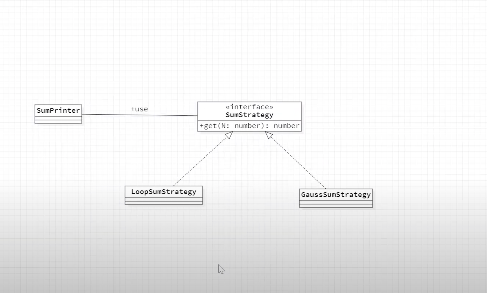

## Strategy Pattern

- Strategy 패턴은 상대적으로 단순한 패턴이지만 객체 지향 프로그래밍에 핵심을 단순하고 명확하게 사용한 패턴 중에 하나이다

- Strategy란 단어의 뜻은 전략으로 프로그래밍에서 전략은 어떤 문제를 해결하는 방법인 알고리즘을 의미한다

- Strategy 패턴은 어떤 하나의 기능을 구성하는 부분을 실행 중에 다른 것으로 효과적으로 변경할 수 있는 방안을 제공한다

- 즉 필요할 경우 실행 중이라도 Strategy를 바꿀 수 있는 패턴이다.

- 아래와 가팅 어떤 하나의 기능이 있다고 할 때

```shell

단계1

단계2 <- 단계 2에 대한 알고리즘을 Strategy을 적용하여 실행중에 변경할 수 있음

단계3

```

- 기능을 실행하기 위해서는 단계 1에서부터 단계 n까지 순서대로 실행되어야 한다고 하자

- 이때 단계 2에 대해서는 어떠한 이유로 실행 중에 동적으로 변경될 필요가 있을 때 Strategy 패턴을 적용해서 효과적으로 이 기능을 구현할 수 있다.

- 정리해보면, Stragety 패턴은 어떤 기능에 대해서 특정 알고리즘을 느슨하게 결합시켜주는 패턴이다

- 어떤 알고리즘이 느슨하게 결합되면 추후 더 나은 알고리즘으로 쉽게 변경할 수 있을 뿐 아니라 프로그램 실행중에 상황에 맞는 알고리즘으로 쉽게 변경할 수 있다

- 또한 기존의 알고리즘을 유지하면서 새로운 알고리즘을 효과적으로 추가할 수 있다

### 게임 예시

- 각각의 게임 유닛은 아래와 같이 선택을 하면은 이제 메시지를 출력을 한다고 가정을 해보자

  - 캐리어 -> 'Carrier has arrived'

  - 다크템플러 -> 'Adun Toridas'

  - 커세어 -> 'It is a good day to die'

- 그러면 이러한 그 캐릭터들이 출력하는 것들을 함수로 넣어서 어떠한 객체 안에 보관을 할 수 있다

```js
const Units = {
  캐리어: () => "Carrier has arrived",
  다크템플러: () => "Adun Toridas",
  커세어: () => "It is a good day to die",
};
```

- 그 다음에 아래처럼 메인 로직은 따로 위에서 모아둔 전략들을 필요할 때 마다 호출하면 된다

```js
const getDialogues = (unitName) => {
  return Units[unitName]();
};
```

- 그러면은 전략이 바뀌어도 위 코드는 수정될 일이 없다.

- 전략만 따로 선언해 두면 된다

- 그래서 어떠한 동작에 대한 메인 로직은 이것만 보고 판단을 하는 것이다

- 그리고 메인 로직에 다른 코드를 넣을 수도 있다

## 차트가 필요한 서비스 예시

- 어떠한 서비스에서 뭐 다양한 차트를 어떠한 이유에서 선택한다고 하자

- 파이 모양의 차트를 할 수도 있고 이런 도넛 모양의 차트를 보여준다거나 아니면 어떠한 시기에는 라인 차트를 보여줘야 되는 상황이라고 가정해보자

- 그러면 아래처럼 바 차트 만들고 뭐 도넛 차트 만들고 라인 차트 만들고 이렇게 해야 된다

- 이렇게 되면은 중복 코드도 생기고 전략별로 개별적으로 매번 컨트롤 해야 된다

```js
const chart = new BarChart();
chart.render(data);

const chart = new DonutChart();
chart.render(data);

const chart = new LineChart();
chart.render(data);
```

- 이렇게 되면 통합적인 컨트롤이 안 되는 상황이 된다

- 그래서 공통적인 차트라는 컴퍼넌트를 딱 만들고 전략을 분리할 수 있는데

- 즉, 하위 로직으로 분리해 버리는 것이다

- 그러면 아래처럼 바 차트와 같은 전략을 따로 만들고 차트 컴포넌트는 바 차트나 도넛 차트들을 주입 받아서 차트가 동작하는 것이다

```js
const chart = new Chart(new BarChart());
chart.render(data);

const chart = new Chart(new DonutChart());
chart.render(data);
```

- 즉 아래처럼 메인 비즈니스 로직은 차트 안에 있고 전략은 별도로 존재하게 되는 것이다

- 아래처럼 식으로 전략을 파라미터로 받고 chartType 속성으로 받아서 이제 개별적인 전략의 render 함수를 부르는 것이다

- 물론 render는 위 코드와 같이 전달되는 바, 도넛 차트의 인스턴스에 정의가 되어 있어야 한다

- 즉, 차트는 껍데기 역할로서 어떠한 전략을 받아서 어떠한 로직을 수행하는 것이라고 볼 수 있다

- 전달되는 차트가 바뀌어도이 차트 컴퍼넌트는 변경될 일이 없는 것이다.

```js

class Chart[
  constructor(stargety){
    this.chartType = stargety
  }

  render(data){
    this.chartType.render(data)
  }
]

```

## 클라이언트 라우팅

- 리액트를 사용하는 경우 클라이언트 라우팅을 많이 하는데

- 라우팅은 결국에는 어떠한 url에 매칭되는 컴퍼넌트를 렌더링 하는 방식이기 때문에

- 아래처럼 코드를 작성해서 url에 맞는 컴포넌트를 렌더링할 수 있다

- 이것도 전략 패턴이다.

```js
// 라우팅 설정

const routes = {
  "/post": new PostList(),
  "/post/:id": new PostItem(),
};
```

- 아래 코드와 같이 라우팅을 부리는 로직을 보면

```js
// 라우팅을 부르는 로직

const viewComponent = this.routes[path];
viewComponent.renderLayout();
```

- `this.routes[path]`가 위의 라우팅 설정의 routes라고 가정해보면

- path는 '/post'나 'post/:id/' 가 되는 것이고

- 이렇게 전달받은 컴포넌트를 viewComponent 에서는 renderLayout을 하는 것이다

- 물론 이 때도 routes의 path에 해당하는 컴포넌트에 renderLayout가 정의되어 있어야 한다

- 그래서 routes의 url과 어떠한 라우팅 경로가 바뀌어도이

- 라우팅을 부르는 로직인 메인 로직은 변경될 일이 없다.

- 메인 로직은 변경이 되지 않지만 각각의 전략을 따로 묶어서 보관해서

- 선언해 두는 이런 방식들이 전략 패턴의 장점이다

- 전략이 여러가지 있을 때 메인 로직은 수정될 일이 없고

- 전략만 추가해서 거기다가 넣어 주면 되는 식으로 전략 패턴을 활용을 할 수가 있다.

### 클래스 다이어그램

- 아래 클래스 다이어그램은 실습 예제에 대한 내용이다

  

- SumPrinter는 1부터 어떤 수까지 통합을 출력해 주는 클래스이다

- 이때 1부터 어떤 수까지의 총합은 SumStrategy 라는 인터페이스를 통해서 얻어온다

- 그리고 1부터 어떤 수까지의 총합을 얻는 구체적인 실행 코드는 sumStrategy 인터페이스를 구현한 LoopSumStrategy 클래스와 GaussSumStragety 클래스를 통해서 코드가 작성된다

- 중요한 점은 SumPrinter는 SumStrategy 인터페이스만을 사용해서 코드가 작성된다는 점이다

- 즉, SumPrinter 클래스는 실제 총합을 계산하는 LoopSumStrategy 클래스와 GaussSumStragety 클래스를 전혀 알 필요가 없다.

- 이로 인해서 추후에 총합을 계산하는 방법이 개선되어 다른 알고리즘이 추가되었을 때 기존의 SumPrinter 클래스의 코드를 전혀 변경할 필요가 없다.

### 클래스 다이어그램 구현

- 가장 먼저 SumStrategy 인터페이스를 아래와 같이 작ㄱ성한다

```js
// SumStrategy.ts

export default interface SumStrategy{
  get(N:number):number
}

```

- 그리고 SumStrategy 인터페이스의 구현 클래스 중 LoopSumStrategy 클래스를 어래처럼 추가해준다

```ts
// LoopSumStragety.ts
import SumStrategy from "./SumStrategy"; // 인터페이스 import

export default class LoopSumStrategy implements SumStrategy {
  get(N: number): number {
    let sum = 0;

    for (let i = 0; i <= N; i++) {
      sum += i;
    }

    return sum;
  }
}
```

- SumStrategy 인터페이스의 또 다른 구현 클래스 GaussSumStragety 클래스를 어래처럼 추가해준다

```ts
// GaussSumStragety.ts
import SumStrategy from "./SumStrategy"; // 인터페이스 import

export default class GaussSumStragety implements SumStrategy {
  get(N: number): number {
    return (N * (N + 1)) / 2;
  }
}
```

- 그리고 나서 SumPrinter는 클래스를 구현해준다

```ts
// SumPrinter.ts

export class SumPrinter는 {
  print(strategy: SumStrategy, N: number, domOutput: Element) {
    const value = strategy.get(N); // 1부터 N까지 합을 계산
    domOutput.innerHTML = `1~${N} 까지의 총합 = ${value}`;
  }
}
```

- 이 클래스는 1부터 n까지 총합을 출력하는 print 메서드를 제공하고

- print 메서드는 3개의 인자를 전달받는다

- 첫번째 인자는strategy 인터페이스,

- 두번째는 1부터 N까지 합을 계산하기 위한 N 값,

- 그리고 세 번째 인자는 개선 결과를 출력할 DOM 객체이다

- 위에서 작성된 코드를 아래처럼 사용 수 있다

```ts
import SumPrinter from "./SumPrinter";
import LoopSumStragety from "./LoopSumStragety";
import GaussSumStragety from "./GaussSumStragety";

const printer = new SumPrinter();

const dom1 = document.crateElement("h1"); // 계산 결과를 출력하기 위한 DOM 객체
document.body.append(dom1);

const dom2 = document.crateElement("h1"); // 계산 결과를 출력하기 위한 DOM 객체
document.body.append(dom2);

// LoopSumStragety 방식을 사용해서 1부터 100까지 합을 보여준다
printer.print(new LoopSumStragety(), 100, dom1);

// GaussSumStragety 방식을 사용해서 1부터 100까지 합을 보여준다
printer.print(new GaussSumStragety(), 100, dom2);
```

- 이처럼 하나의 기능에 대해서 서로 다른 방식의 알고리즘을 실행 중에 변경할 수 있는 것이 Stragety 패턴이다

---

### Reference

- [기획이 바껴도 괜찮아~ (일상의 디자인패턴 2편)](https://www.youtube.com/watch?v=hCUw3zNRioM&t=29s)
- [TypeScript로 보는 GoF의 디자인 패턴: 4. Strategy](https://www.youtube.com/watch?v=TiHzYc8I3Kk&list=PLe6NQuuFBu7H3sFnErshsfgNPE9dOZZrx&index=5)
